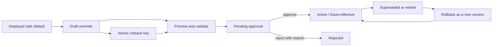

# Resource360 configuration control matrix

## Control objective

Resource360 separates business configuration from Salesforce platform configuration. Authorized EXL operators can change business rules, taxonomies, thresholds, deadlines, scoring weights, escalation tiers, notification routes and KPI targets without an Apex deployment. Every runtime change is validated, versioned, effective-dated, attributable, approved by a separate control permission and recoverable as a new rollback version.

“Fully configurable” does not mean that secrets, security permissions, schema or executable code become editable data. Those controls remain release-managed because exposing them through an administrator form would weaken the security and change-control boundary.

## Lifecycle and separation of duties

| Actor | Salesforce control | Allowed activity |
|---|---|---|
| Configuration operator | `Resource360_Manage_Configuration` | View catalog/history, preview, save/edit a draft and submit it |
| Configuration approver | `Resource360_Approve_Configuration` | Approve/reject, activate, restore a prior value as a new version and apply the governed scheduler cron |
| Auditor | `Resource360_View_Audit` | Read configuration history, validation result, actor/time and immutable audit evidence |
| Administrator | Break-glass demo access | Holds all controls for recovery; it is not the normal production operating model |

The object guard rejects direct activation, illegal state transitions, post-submission value mutation and deletion. Configuration values cannot contain credential material. Runtime services select only approved records whose effective dates include the global UTC policy date, so users in different time zones see the same active version; deployed custom metadata is the deterministic fallback.

## Configurable business surface

| Domain | Governed values | Runtime consumers and effect |
|---|---|---|
| Delivery roles | Active flag, stable role code, label, Salesforce tower, effective dates | Staffing, WBS, talent search and practitioner profile choices |
| Classification | Active flag, billability, control/SOW requirements, default review days and escalation policy | Staffing validation, immutable allocation billability snapshot, unbilled controls and analytics |
| General LOV | Add/disable effective values by `listKey` | Budget phases, work units, delivery locations and planning effort modes in Lightning forms and server validation |
| Capacity and planning | Default daily capacity, validation range, interactive preview range and effort modes | Calendar/capacity checks and staffing-plan preview |
| Staffing | Request expiry hours | SLA due time, expiry job and overdue metrics |
| Budget and WBS | Policy version, 30/25/20 defaults, three approver roles, maximum months, phases, work units and locations | Server economics, route selection, WBS validation and captured policy/signature evidence |
| Capability and credentials | Maximum proficiency, maximum experience and credential warning days | Claim validation, credential maintenance and candidate gates |
| Talent ranking | Default/result limits, experience denominator, project-recency bands/ratios, duration denominator and six fit weights | Explainable candidate scoring; non-zero weights are normalized proportionally to 100 |
| Timesheets | Submission window/day/hour, decision and auto-approval days, correction window/hour, maximum daily hours, dual-control flag and two correction approver roles | Calendar-aware deadlines, exception escalation, auto-approval and independent corrected-time decisions |
| Source freshness | People warning/block hours, Engagement block hours, Commercial block hours and Learning warning/disable hours | Workspace policy disclosure; People/Engagement fail-closed staffing gates; Commercial fail-closed budget submission; learning-only evidence remains non-authoritative when stale |
| Interactive and inbound operations | Bulk and inbound row limits, initial integration-error retry | Preflight/commit and REST ingestion boundaries |
| Durable delivery | Outbox attempt limit and retry sequence | Retry-pending/dead-letter behavior |
| Scheduler | Salesforce cron expression | Staffing, credential, timesheet, unbilled, outbox and notification maintenance after explicit approver application |
| Unbilled escalation | JSON tiers of strictly increasing `days`, accountable `role` and `Normal/High/Critical` severity for WAR, IFB/Blocked, Shadow Lateral and fallback | Idempotent owner/role notifications from the operations scheduler |
| Notifications | Approved channel list | Salesforce in-app route now; Email and Teams become usable only after their environment-owned adapters are activated |
| KPI | Billed target, WAR maximum, IFB maximum, approved-actuals lookback and staffing lifecycle lookback | Command Center actual-versus-target metrics, populations and definitions |
| Assurance and retention | Standard monthly budget hours, source completeness, alert closure note, scenario horizon, audit/business retention days and legal-hold switch | Roster variance checks, source health, accountable alerts, bounded scenarios and non-destructive retention preview |

The repository currently contains 82 policy defaults, 20 effective delivery-role defaults, 16 classification defaults, 13 source contracts, 18 persona mappings and eight retention rules (157 custom-metadata records). Runtime overrides are records, so the catalog can grow without recompiling consumers when the domain contract already supports the new code or value.

Two or more draft settings may share a release key. Release preview enforces one version per configuration key, one effective date and cross-setting budget threshold order. Submission moves the entire bundle to pending approval; an independent approver activates or rejects every member atomically. The release identity becomes immutable after submission.

## Validation and impact preview

Before save or approval, the control plane checks:

- domain, stable code, value type, required typed value, reason and effective-date order;
- numeric safety bounds and valid JSON;
- strictly increasing escalation days, valid severity and accountable roles;
- budget margin ordering and People/Learning warning-versus-block ordering;
- required tower attributes for delivery roles, classification flags and `listKey` for controlled values;
- duplicate active policy codes across runtime domains;
- talent-weight viability and proportional-normalization warning;
- absence of common token, secret, private-key and auth-material patterns.

The preview returns the current value, normalized proposed value, consuming surfaces, blocking errors and warnings. Activation and rollback write immutable audit evidence. Business decisions capture policy/signature/classification snapshots where a later setting change must not rewrite history.

## Deliberately release-controlled

The following are not ordinary runtime configuration:

| Control | Why it remains outside the admin console |
|---|---|
| Named/External Credentials, tokens, certificates and private keys | Secrets require encrypted Salesforce credential stores and environment-specific principals |
| EXL endpoints, network routes and middleware subscriptions | Connectivity, egress and trust boundaries require architecture/security approval and contract tests |
| Objects, fields, formulas, triggers, Apex/LWC and API schemas | Executable/schema changes require version control, automated tests, deployment review and rollback |
| CRUD/FLS, sharing model, permission sets/groups and custom permissions | Authorization cannot be safely delegated to a business-rule editor |
| Hard governor-limit safety ceilings and transaction algorithms | These protect tenant stability and atomic invariants |
| Retention, legal hold, backup, encryption and Event Monitoring settings | These are org/platform and regulatory controls, often license-dependent |
| SSO, identity/group mappings and production users | These depend on EXL identity governance and the target production org |

## Remaining production activation, not hidden product configuration

The demo control plane is complete for the business surfaces above. Production still requires EXL to supply and approve:

1. the production Salesforce org, edition/licenses, SSO/group mappings and named accountable people;
2. facade endpoint contracts, External/Named Credentials, middleware routing and certified source timestamps/data;
3. Email/Teams dispatch adapters and enterprise dead-letter/incident destinations;
4. KPI reconciliation, taxonomy and threshold approvals against representative EXL data;
5. retention/legal-hold, privacy, security, backup/restore, monitoring and recovery evidence;
6. migration, volume/concurrency/performance, accessibility and persona-based UAT evidence;
7. production release/cutover/rollback approval.

No identified business-configuration surface remains as hidden code-only backlog in the sanitized mock baseline. New business concepts can still require a versioned schema/service release; that is normal product evolution, not unrestricted runtime configurability.
