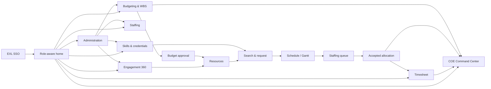
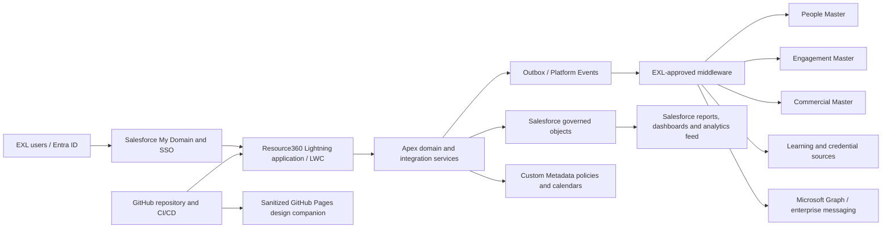
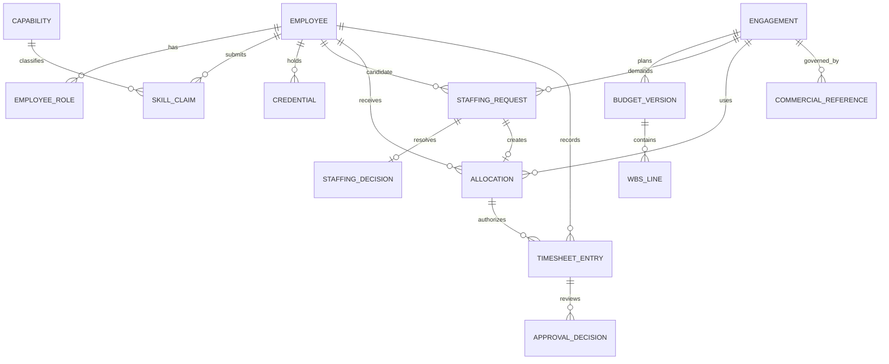

# EXL Salesforce COE Resource360

## Consolidated Product Requirements Document

| Document field | Value |
|---|---|
| Status | Implemented Salesforce-native demo baseline; production activation requires the external gates in Section 19 |
| Version | 1.2 |
| Date | 23 August 2026 |
| Product name | EXL Salesforce COE Resource360 |
| Product scope | Engagement 360, Resource Management, Salesforce Skills & Credentials, Budgeting/WBS, Timesheet and COE Command Center |
| Target organization | EXL Salesforce Center of Excellence (COE) |
| Evidence boundary | Functional and interaction evidence derived from `RMG.zip`, including its videos and embedded Azure DevOps repository snapshot; EXL theme guidance is taken from EXL's official brand guidelines |
| Legacy repository provenance | Azure DevOps project `BizTech`, repository `RMG`, embedded remote `https://dev.azure.com/acidaes/BizTech/_git/RMG`; this is reference evidence, not the target EXL production repository |
| Embedded branch reviewed | `sms-system-build`, local archive snapshot at commit `16cfb4d594930a5902f9aa3c754ec3bc26e38ec7` |
| Video review | 37 archive videos inventoried; 4 exact duplicate pairs; 33 unique videos (approximately 12.9 hours) reviewed across their duration |
| Screen scope | 103 routed pages, full-screen steps, drawers and decision-critical modals drafted across the target product |
| Requirement scope | 109 functional/admin requirements plus 25 UAT scenarios (134 traced items), 16 resolved product decisions and the build-readiness controls in Section 17 |
| Traceability register | `docs/REQUIREMENTS_TRACEABILITY.md`, generated from this PRD and the governed screen catalogue; covers all 134 requirement/UAT items and all 103 screens |
| Intended reviewers | EXL Salesforce COE leadership, COE Staffing, Delivery, Product, Engineering, Finance, HR/L&D, PMO, Information Security, Brand/Marketing and Operations |
| Assumption policy | Named logical EXL systems, technologies, policies, volumes, service levels and ownership in this version are binding planning assumptions, not claims about EXL's current estate. A later approved change replaces an assumption through versioned change control; it does not block estimation or solution design. |

| Version | Date | Change |
|---|---|---|
| 0.2 | 21 August 2026 | Evidence-led functional requirements, EXL theme and 103-screen catalogue |
| 1.0 | 21 August 2026 | Resolved all 16 decisions; established MVP/release scope, assumed EXL logical sources, architecture, canonical model/contracts, UX inheritance, security/retention, SLOs, notifications, classification policy, migration, traceability, RACI, AI gates and business case |
| 1.1 | 22 August 2026 | Re-baselined the production runtime as Salesforce Lightning, Apex and Salesforce data; retained GitHub Pages solely as a sanitized design companion; made EXL production-org activation, identity, integration, migration, monitoring, security and UAT explicit release gates |
| 1.2 | 23 August 2026 | Aligned the PRD to the implemented demo: effective classifications and billability snapshots, ranked/strict talent matching, KPI definitions, timesheet escalation and exception-free auto-approval, native report types/history, generated permission and traceability controls, and an explicit production-activation runbook |

---

## 1. Executive summary

EXL Salesforce COE Resource360 should become the COE's unified delivery-control backbone. It should connect Salesforce engagement economics, skills and credentials, staffing decisions, resource allocations, approved work, timesheet actuals and leadership reporting in one governed flow:

**Engagement and SOW/PO setup → approved WBS/budget → resource request → Salesforce capability-based candidate discovery → Staffer approval → committed allocation → timesheet actuals → profitability and utilization control.**

The ZIP provides a mature functional reference rather than an EXL-ready product. It contains a live Resource Allocation System (RAS) baseline, an MVP 1.5 enhancement program, static end-to-end prototypes, a substantial deployable Skills Management System (SMS), budgeting specifications, timesheet requirements, operating-governance material, business test cases, leadership dashboard designs and 33 unique videos. It also contains BusinessNext-specific branding, identifiers, source systems and conflicting historical rules. This PRD retains the proven interaction and business-rule evidence, re-frames the product for the EXL Salesforce COE, and does not treat a legacy prototype or archive decision as automatically approved for EXL.

The target product has five operating components:

1. **Engagement 360 / Resource Management** is the authoritative engagement staffing and allocation experience in the EXL Salesforce Lightning application.
2. **Budgeting/WBS** owns versioned planned effort, cost, revenue, margin and approval.
3. **Salesforce Skills & Credentials** owns the COE capability taxonomy, verified profiles, Salesforce certifications and skill-based talent search.
4. **Timesheet** captures actual effort only against accepted allocations and returns actuals for variance and profitability reporting.
5. **COE Command Center** gives Delivery, Staffing and leadership utilization, skills, demand, budget-versus-actual and exception views with drill-down and action ownership.

The approved near-term baseline is a controlled integration release, not an autonomous AI release. It establishes EXL identity and master-data contracts, implements the Staffing approval gate, enforces allocation and budget rules server-side, connects accepted allocations to timesheets, represents Salesforce roles/clouds/certifications correctly, and publishes trusted operational dashboards. Predictive and agentic capabilities remain a later phase after the underlying data and workflow are reliable.

### 1.1 Current-state conclusion

| Capability | Evidence-based status | PRD treatment |
|---|---|---|
| Legacy RAS MVP1 | Evidenced as live and used in the source environment | Functional reference to reproduce selectively, not an EXL production baseline |
| Legacy RAS MVP1.5 | Tracker contains mixed Delivered, QA Pass, Testing, Dev in Progress and QA Fail states; an executive deck describes sign-off | Candidate requirements requiring EXL validation |
| Staffer workflow | Demonstrated in the integrated prototype and detailed in the August 2026 plan | P0 target capability; not assumed live |
| Legacy SMS | Deployable FastAPI/PostgreSQL/React implementation with extensive automated tests | Reusable design/engineering reference; EXL identity, taxonomy and learning-source integration remain mandatory |
| Budgeting/WBS | Detailed calculation specification and functioning prototype; portal, SSO, deployment and UAT work remain | P0/P1 integration stream; not assumed production-integrated |
| Timesheet | Existing base capability; accepted-allocation linkage is partly evidenced | Preserve base and apply the governed v1 deadlines, approval, auto-approval and correction rules in this PRD |
| Command Center | Leadership sample and metrics exist | Operational reporting target requiring metric certification |
| Predictive/AI Resource Management | Architecture and roadmap concepts exist | Future phase only |

### 1.2 Decisions made by this PRD

Where archive artifacts conflict, this PRD adopts the following target rules:

- **Allocation over 100% is a hard block**, not a warning that may be overridden. Overlapping assignments are permitted only while total applicable capacity remains at or below 100%.
- **A Project Manager creates a soft, pending allocation request.** Capacity is committed only when a Staffer accepts it. This is the archive's most fully specified staffer model and matches the integrated prototype.
- **Accepted allocations alone enable timesheet charging.** Pending and declined requests never appear in the employee's timesheet.
- **Billability is derived from engagement classification.** A separate Billable field is not captured.
- **Budget approval thresholds are effective-dated configuration.** The production baseline is the implemented budgeting rule of 30% / 25% / 20%; the conflicting BOOST bid policy is not active in Resource360.
- **Eight hours per business day is the initial capacity default, not hard-coded policy.** Calendars, work patterns and daily capacity must be configurable.
- **Skills search supports both strict filtering and ranked search.** Engagement 360 consumes strict eligibility results; the Skills workspace provides a ranked shortlist.
- **BusinessNext branding and MY Portal names are not carried into the target UI.** The EXL master brand, Salesforce COE terminology and EXL-approved enterprise integrations apply.

---

## 2. Product problem

Delivery planning is fragmented across project records, manual allocation decisions, employee profiles, learning systems, budgeting models and timesheet reporting. The archive identifies recurring consequences:

- Project Managers can ask for or allocate people without a consistent staffing approval process.
- Availability alone does not establish role fit; skills, experience, location, grade and organizational scope are held separately or are incomplete.
- Planned effort and margin are disconnected from accepted staffing and actual effort.
- Allocation overlaps, historical changes and backdated corrections require stronger control and auditability.
- Unbilled categories such as WAR, IFB/PO Awaited, Blocked and Shadow need time-bound governance and escalation.
- Leaders need a consistent path from enterprise KPI to portfolio, account, project and employee-level action.
- Product-skill data and some organizational attributes are unavailable or stale in the current SMS upstream.

The product must replace these disconnected control points with a single auditable operating model while consuming employee, engagement and commercial context from the logical EXL systems of record defined in Sections 9 and 17. The implementation integrates through stable EXL façade contracts so a later change to an underlying HRIS, PSA, ERP or learning vendor does not change Resource360's canonical model. Legacy source names in the ZIP are mappings only and are not target architecture decisions.

---

## 3. Vision, goals and non-goals

### 3.1 Vision

Enable every delivery staffing and cost decision to be made from current capacity, verified skills, approved economics and governed classifications, with actual performance visible to the same chain of accountability.

The product should support EXL's official Salesforce positioning across platform assessment and modernization, domain digital solutions, data/AI-led automation, COE augmentation and Agentforce/Einstein delivery. These are capability and demand dimensions in Resource360; they do not turn the staffing platform itself into a client-facing Salesforce solution.

### 3.2 Goals

| ID | Goal | Target measure |
|---|---|---|
| G-01 | Reduce time to find qualified candidates | Median candidate shortlist generated in under 5 minutes |
| G-02 | Make staffing decisions skills-aware | At least 80% of staffed requests use one or more skill/experience filters within 60 days of rollout |
| G-03 | Establish profile readiness | At least 90% of active delivery employees have a reviewed industry-skill profile by launch cohort deadline |
| G-04 | Prevent capacity breaches | Zero accepted allocations that make an employee exceed configured capacity |
| G-05 | Enforce commercial readiness | Zero production allocations to a project without an approved, current budget/WBS unless an audited emergency exception is explicitly configured |
| G-06 | Improve staffing responsiveness | At least 95% of pending staffing requests decided within 3 calendar days |
| G-07 | Connect plan to actual | At least 98% of submitted project time maps to an accepted allocation and valid work date |
| G-08 | Make profitability actionable | Budget-versus-actual effort, cost and margin visible by project, portfolio and reporting period by T+1 business day |
| G-09 | Govern unbilled capacity | 100% of time-bound unbilled exceptions have an owner, start date, age and escalation state |
| G-10 | Preserve accountability | 100% of budget, staffing, allocation, skill-review and timesheet decisions are attributable and time-stamped |
| G-11 | Make Salesforce capability supply visible | Certified supply and verified proficiency are reportable by Salesforce tower, role, industry, geography and grade for every launch population |
| G-12 | Keep credentials trustworthy | 100% of credentials used as mandatory staffing gates have an approved verification source and current verification/maintenance state |

Targets are product objectives and require baseline measurement during pilot. They are not claims about current performance.

### 3.3 Non-goals for the integration release

- Autonomous allocation or deallocation without a human decision.
- Generative or predictive recommendations presented as authoritative before data-quality gates pass.
- Replacement of EXL's approved employee, project/PSA, ERP or learning systems of record.
- Replacement of Salesforce's credential or learning platforms; Resource360 consumes authorized verification data where integration is available.
- Full financial accounting, invoicing, revenue recognition or payroll.
- Public marketplace or employee job-posting functionality.
- Redesign of unrelated EXL enterprise portal modules.
- Mobile-native applications. Responsive approval views may be delivered, but native apps are not in scope.

---

## 4. Users, roles and segregation of duties

| Role | Primary responsibility | Required access |
|---|---|---|
| Salesforce COE practitioner | Maintain industry and Salesforce capability evidence; view verified learning and credentials; submit time | Own profile, own allocations, own timesheet |
| Reporting Manager | Review skill claims and approve/reject team timesheets | Direct-report scope or configured subtree |
| Salesforce Engagement Manager / Project Manager | Create and manage engagement budgets; raise resource requests; view staffing and actuals | Assigned engagement scope |
| COE Delivery / Portfolio Lead | Perform delivery functions across an assigned Salesforce capability tower, industry, geography, client or portfolio | Configured portfolio/engagement scope |
| COE Staffer / Resource Manager | Arbitrate pending resource requests; accept or decline; manage staffing exceptions | Authorized Salesforce talent pool and engagements |
| Portfolio / Account Owner | Review portfolio budgets, utilization and staffing exceptions | Assigned portfolio/account scope |
| Head of Delivery (HOD) | Approve margin exceptions and manage delivery-wide exceptions | Delivery hierarchy scope |
| General Manager / COO delegate | Approve highest-risk budget exceptions and view enterprise controls | Organization scope as configured |
| Finance / PMO analyst | Review project economics, actuals and approved commercial state | Read-only governed scope; decision role if configured |
| Salesforce Capability / L&D administrator | Maintain Salesforce and industry taxonomy, certification mappings and learning-source mappings | Skill catalogue and credential administration |
| System Administrator | Configure LOVs, calendars, thresholds, roles, integrations and operational settings | Administrative access, separated from business approvals where practicable |
| Auditor / Read-only leadership | Inspect versions, decisions, changes and KPI lineage | Read-only authorized scope |

### 4.1 Segregation rules

- The PM who requests a resource must not be treated as the Staffer who accepts it merely because one person holds both technical roles. The active business role and decision must be recorded.
- Project Manager and Reporting Manager are distinct responsibilities. Timesheet approval is driven by reporting relationship or configured approval chain, not by the PM role alone.
- Budget approvers must not approve their own submission at the same approval level unless a formally approved emergency-control policy allows it.
- Administrator rights do not automatically confer business approval authority.
- Any temporary delegated authority must have an effective period, delegator, delegate, scope and audit record.

---

## 5. Target operating flow

1. An EXL-approved engagement/project master creates or updates the engagement and its commercial metadata, including dates, status, client/account and applicable PO/SOW information.
2. The PM prepares a versioned WBS/budget by phase, month, role, location and planned allocation.
3. The system calculates effort, burdened cost, travel, revenue and margin on the server and routes approval according to the active approval policy.
4. Once the current budget is approved, Engagement 360 permits staffing requests within the eligible engagement window.
5. The PM searches by availability/resource or hands off to Salesforce Skills & Credentials for strict role, cloud, proficiency, certification, industry and experience filtering.
6. The PM classifies selected resources, chooses engagement roles and schedules proposed effort using auto-allocation, Gantt interaction or explicit input.
7. The system validates dates, employment, calendars, project status, budget/WBS coverage and capacity. Valid requests are created as **Pending Staffing** soft holds.
8. The Staffer sees the queue, candidate fit, concurrent assignments, classification, budget context and conflicts. The Staffer accepts or declines with a reason where required.
9. Acceptance commits capacity, creates or versions the allocation line and enables the project/role on the employee's timesheet for the applicable dates. Decline releases the soft hold.
10. The employee records time. The Reporting Manager approves or rejects it according to the governed weekly process.
11. Approved actuals feed project and leadership views for effort, utilization, cost, margin and exception monitoring.
12. Modifications, splits, extensions, deallocations and corrections follow the same validation and audit rules, with new line-item versions where economic or classification meaning changes.

---

## 6. Experience design and complete screen catalogue

This section is the screen-level product draft for the EXL Salesforce COE. It combines the workflows visible in the ZIP's short walkthroughs, long requirement/demo recordings, integrated 2026 prototype and embedded source implementation. A “screen” includes a routed page and any decision-critical full-screen step, drawer or modal that requires its own content, validation or acceptance criteria.

### 6.1 Experience principles

1. **One COE, one operating flow.** Engagement, budget, skills, staffing and actuals should feel like one product even when separate services own the data.
2. **Decision first.** PMs, Staffers, approvers and managers should see the context needed to decide without opening multiple browser tabs or spreadsheets.
3. **Data density with hierarchy.** The product serves planners working with wide tables, Gantt timelines and large portfolios. It should be compact, but use strong grouping, progressive disclosure and sticky context.
4. **State is never implied by color alone.** Pending, accepted, declined, expired, stale, unverified and blocked states require text/icon labels and accessible descriptions.
5. **Source and freshness are visible.** Employee, credential, learning, budget and actuals surfaces show source and last refresh when freshness affects a decision.
6. **Explainable recommendations.** Search and future AI surfaces expose the factors and gaps behind a recommendation. Human ownership remains clear.
7. **Stable context.** Engagement, person, date range, active role and organizational scope persist when moving between related screens.
8. **EXL master-brand discipline.** The product uses EXL's identity rather than carrying forward BusinessNext colors, wordmarks or system names from the videos.

### 6.2 EXL design theme

The target visual language follows the current [official EXL brand guidelines](https://www.exlservice.com/themes/exl_service/brand-assets/EXL-Brand--Guidelines.pdf). The archive UI remains functional reference only.

#### 6.2.1 Brand rules

- Use the approved EXL master logo in orange or white on a permitted contrasting background. Do not redraw, recolor, distort or place it inside a new product mark.
- Do not create a separate logo for Resource360, the Salesforce COE, Skills, Budgeting or Command Center. Display the product name as ordinary text adjacent to, but not locked into, the EXL logo.
- Minimum EXL logo width on screen is 44 pixels; preserve clear space equal to the full height of the “X” letterform.
- Any Salesforce logo or joint lock-up requires EXL Corporate Marketing and the relevant Salesforce/legal approval. Where approved, follow equal-size and clear-space rules. Otherwise use “Salesforce COE” as text.
- Use sentence case in navigation, headings, buttons and table labels.

#### 6.2.2 Core tokens

| Token | Value | Product use |
|---|---|---|
| `brand.orange` | `#FB4E0B` | Primary CTA, active navigation marker, selected key KPI, focus emphasis; use thoughtfully rather than as a full dense-table fill |
| `neutral.black` | `#000000` | High-contrast header/footer and approved dark surfaces |
| `neutral.white` | `#FFFFFF` | Primary work surface and text on dark/orange backgrounds where contrast passes |
| `brand.slate` | `#2E3643` | Primary body text, dark shell alternative, table header text |
| `brand.midnight` | `#005071` | Secondary action, links, planning bars and analytical emphasis |
| `brand.lightBlue` | `#DCF3FA` | Low-emphasis page sections, selected rows and informational surfaces |
| `surface.subtle` | `#F6F8FA` | Neutral page background and grouped controls |
| `border.default` | `#D6DADE` | Tables, dividers and input borders |
| `status.success` | Accessible green | Accepted, approved, healthy and within target |
| `status.warning` | Accessible amber | Due soon, pending SLA, partial fit or approaching threshold |
| `status.danger` | Accessible red | Blocked, declined, expired, over capacity or approval failure |
| `status.info` | Accessible blue | Informational, planned or externally sourced state |

Semantic colors must be tested independently from brand colors. EXL Orange is not the sole indicator for warning or destructive action.

#### 6.2.3 Typography and density

- Use **Yantramanav** as the primary digital font. Fallback stack: `Yantramanav, Arial, sans-serif`.
- Use Yantramanav Light for display/page headings and Regular/Medium for UI controls and body copy. Use tabular numerals for hours, percentages, currency and dates.
- Calibri is reserved for generated Microsoft Office outputs in line with EXL guidance.
- Default body text is 16 px; dense tables may use 13–14 px when zoom and reflow remain accessible. Button text is at least 16 px on standard layouts.
- Use an 8-point spacing grid. Page gutters: 24 px desktop, 16 px tablet, 12 px small viewport. Primary interactive targets are at least 44×44 px.

#### 6.2.4 Layout and component language

- **Desktop shell:** 64 px top bar; collapsible 72/240 px left rail; sticky page title/context strip; content area optimized for 1366 px and 1440 px screens seen in the recordings and tested through 1920 px.
- **Data grids:** sticky header and first identity column, column chooser, density control, filter chips, saved views, pagination/virtualization, keyboard navigation and export subject to permission.
- **Gantt/planning grid:** frozen resource column, configurable week/month/quarter/year header, non-working-day shading, explicit pending/accepted bars, capacity text in every cell, zoom and horizontal scroll position persistence.
- **Drawers:** use a right-side drawer for person/engagement context so the planner retains the underlying list or Gantt state.
- **Wizards:** show numbered steps, current validation summary and safe Save draft/Cancel behavior. Never clear completed input merely because the user goes back one step.
- **Decision modals:** identify entity, consequence and effective dates; use explicit verbs such as Accept request, Decline request or Deallocate resource rather than generic OK.
- **Cards/KPIs:** one primary value, denominator/definition where relevant, period, delta and freshness. Cards are navigation affordances only when keyboard and screen-reader behavior matches a link.

#### 6.2.5 Theme variants

| Theme | Use | Treatment |
|---|---|---|
| Operations light | Default for Engagement, Staffing, Skills, Budgeting, Timesheet and Admin | White/subtle surfaces, slate text, orange primary action, midnight links, light-blue grouping |
| Planning canvas | Gantt, budget grid and timesheet | Compact controls, frozen headers, increased grid contrast, minimal decorative content |
| Command Center dark | Optional large-screen analytics and control-room mode | Black/slate surfaces, white text, orange hero metrics and restrained semantic/chart palette; all contrast must pass WCAG AA |
| Embedded portal | Engagement 360 tabs hosted within another EXL portal | Reduced chrome and read-only source badges while preserving the same tokens and authorization |
| Print/export | PDF and Microsoft Office output | White background, Calibri for Office files, repeated headers, explicit filter/cutoff/source metadata; no interaction-only meaning |

#### 6.2.6 Screen-frame archetypes

Standard operational workbench:

```text
┌──────────────────────────────── EXL top bar ────────────────────────────────┐
│ EXL | Salesforce COE Resource360 | Search | Scope | Alerts | User          │
├───────┬─────────────────────────────────────────────────────────────────────┤
│ Rail  │ Breadcrumb / page title                         Primary action      │
│       ├─────────────────────────────────────────────────────────────────────┤
│       │ Filter chips / saved view / freshness / density / export           │
│       ├─────────────────────────────────────────────────────────────────────┤
│       │                                                                     │
│       │ Sticky, sortable, keyboard-operable table or cards                 │
│       │                                                                     │
│       ├─────────────────────────────────────────────────────────────────────┤
│       │ Pagination / totals / selected-row actions                          │
└───────┴─────────────────────────────────────────────────────────────────────┘
```

Planning canvas:

```text
┌──────── Context, dates, unit, zoom, filters, Auto-allocate, Review ─────────┐
│ Frozen resources │ W1 │ W2 │ W3 │ W4 │ W5 │ W6 │ W7 │ W8 │ Capacity       │
├──────────────────┼────┼────┼────┼────┼────┼────┼────┼────┼────────────────┤
│ Practitioner A   │ accepted bar      │ pending bar       │ 16 h available  │
│ Practitioner B   │ 8 h left │ non-working │ conflict     │ 0 h available   │
│ Practitioner C   │ proposed allocation via click/drag    │ 24 h available  │
├──────────────────┴──────────────────────────────────────────────────────────┤
│ Validation summary / unscheduled reasons             Cancel | Review       │
└─────────────────────────────────────────────────────────────────────────────┘
```

Command Center:

```text
┌──────── Period / geography / portfolio / tower / freshness / definitions ─┐
│ KPI 1 │ KPI 2 │ KPI 3 │ KPI 4 │ KPI 5 │ Critical alerts                  │
├───────────────────────────────┬─────────────────────────────────────────────┤
│ Utilization and capacity trend│ Supply vs demand by Salesforce tower       │
├───────────────────────────────┼─────────────────────────────────────────────┤
│ Unbilled aging and escalation │ Budget vs actual and margin erosion        │
├───────────────────────────────┴─────────────────────────────────────────────┤
│ Drill-down table with owner, age, state and next action                    │
└─────────────────────────────────────────────────────────────────────────────┘
```

#### 6.2.7 Legacy-to-EXL migration map

| Archive reference | EXL Salesforce COE target |
|---|---|
| BusinessNext wordmark and black/pink/lime shell | Approved EXL master logo; black/slate shell; EXL Orange primary action; light-blue/white work surfaces |
| Pink data-grid headers | White or subtle/light-blue header with slate text and orange active-sort/focus indication |
| Lime Allocate/Save buttons | EXL Orange primary button with accessible text; semantic green reserved for confirmed success |
| Magenta toggles and badges | Midnight Blue or EXL Orange for selection; semantic badges based on state |
| Project360 | Engagement 360 |
| Employee Allocation / RAS | Staffing & Allocations / Resource Management |
| SMS | Salesforce Skills & Credentials |
| AcademyNext Product Skills | EXL/Salesforce-approved learning and credential records |
| RMG Command Center | Salesforce COE Command Center |
| RMG Bot / Allocation Bot | Resource Assistant (future, governed) |

### 6.3 Information architecture



### 6.4 Global shell and state contract

Every authenticated screen shall provide:

- EXL logo, product name as text, active role/scope, notifications, help and user menu;
- page title, breadcrumb/back behavior and context such as engagement/person/reporting period;
- source freshness indicator where stale data could change a decision;
- loading, empty, filtered-empty, partial-data, stale, error, unauthorized and offline/retry states;
- unsaved-change protection for forms and planning grids;
- success confirmation with entity and next action, not a generic success icon alone;
- shareable/deep-link URL for authorized routed views without exposing data through query strings;
- keyboard focus order, visible focus, accessible name, error summary and no color-only meaning.

### 6.5 Global and home screens

| Screen | Users | Required content and actions | Required states / video influence |
|---|---|---|---|
| GLB-01 EXL SSO entry | All users | EXL master brand, product name, Entra SSO action, privacy/help links; no local password in production | Authenticating, access denied, inactive employee, no assigned role, service unavailable. Replaces the legacy BusinessNext/demo login shown in videos. |
| GLB-02 Role-aware home | All users | Greeting, active role/scope, priority tasks, pending approvals/reviews, own/team allocation summary, quick actions and freshness | Individual, manager, PM, Staffer, approver, leader and admin variants; empty workload and delegated-role banner. |
| GLB-03 Notification center | All users | Staffing, budget, skill, certification, timesheet, escalation and data-quality notifications; filter, mark read, open entity | Unread/read, failed delivery, expired action, grouped events and accessible live-region behavior. |
| GLB-04 Global search | Authorized users | Search engagements, employees, skills/certifications and requests; entity type filter and recent items | No result, restricted result count without data leakage, stale source and keyboard command mode. |
| GLB-05 Role and scope switcher | Multi-role users | Available roles, current organizational/portfolio scope, delegated authority and effective dates | Role switch clears/scopes cached data; unavailable/revoked role; delegation expiry. |
| GLB-06 User preferences and help | All users | Date/time zone, density, accessibility preferences, saved views, support/runbook links | Reset defaults, unsupported preference, help unavailable. |

### 6.6 Engagement 360 screens

| Screen | Users | Required content and actions | Required states / video influence |
|---|---|---|---|
| ENG-01 Engagement list | PM, Delivery, Staffing, Finance, leadership | Search, saved filters, client/account, engagement ID/name, PM, dates, status, budget approval, staffing health and margin permission-based columns | Loading, no engagements, partial master data, stale commercial data; card or compact-table view. |
| ENG-02 Engagement 360 overview | Assigned roles | Key information, client/account, SOW/PO, dates, status, delivery owner, Salesforce tower, budget/staffing/actuals KPIs and alerts | Read-only source badges, incomplete setup, closed/on-hold status and status-impact banner. Replaces the legacy Project360 header/tabs. |
| ENG-03 Resources tab | PM, Staffer, Delivery | Accepted/pending/declined allocations, employee, Salesforce role, classification, team/tower, billability mapping, dates, hours/% and actions | Table shown throughout allocation/deallocation videos; distinguish no resources, filters, future roll-offs and records pending staffer. |
| ENG-04 Budget tab | PM, approvers, Finance, Delivery | Approved version, P&L summary, margin, planned effort, variance and link to editor | No budget, draft, pending, approved, rejected, invalidated, stale actuals; embedded read-only mode. |
| ENG-05 Actuals and timesheet tab | PM, Delivery, Finance | Planned versus submitted/approved hours, missing time, role/work-unit split and cutoff | No accepted allocation, open period, late/missing, correction pending and reconciliation mismatch. |
| ENG-06 Work plan and milestones | PM, Delivery | Phases, work units, milestones, ownership and dates used by budget/timesheet mapping | Outside engagement dates, unlinked work unit, completed/at-risk. Derived from Project360 milestone/work-unit tabs in videos. |
| ENG-07 Risks and actions | PM, Delivery, leadership | Allocation, commercial, skill, timesheet and margin risks; owner, due date, status and action register | New/acknowledged/in progress/closed, overdue and source-system error. |
| ENG-08 Allocation history | PM, Staffer, auditor | Effective-dated lines, request/decision/change trail, before/after, reason and timesheet impact | Filter by person/date/action; immutable view; export with audit permission. |

### 6.7 Staffing and allocation screens

| Screen | Users | Required content and actions | Required states / video influence |
|---|---|---|---|
| STFUI-01 Add-resource launcher | PM | Entry from Engagement Resources, approved-budget gate, engagement/date defaults and choice of availability, named resource or skills search | Budget blocked, engagement closed, no staffing permission and preserved draft. |
| STFUI-02 Search by availability | PM, Staffer | Start/end, operator, asked availability/capacity, unit, team/tower, group/subgroup, grade, geography/time zone and Apply/Search | Mandatory fields, invalid range, no result, filtered empty and upstream stale. Directly reflects the videos' availability search. |
| STFUI-03 Availability results | PM, Staffer | Multi-select table with practitioner, Salesforce role/title, team/tower, group/subgroup, grade, accepted availability, pending demand and fit entry point | A–Z index/saved filters optional; partial records; pending-soft-demand badge; pagination/virtualization. |
| STFUI-04 Search by resource | PM, Staffer | Named practitioner, date range and Show schedule | No exact identity, inactive employee, out-of-scope employee, missing calendar. |
| STFUI-05 Cross-engagement schedule | PM, Staffer, employee read-only | Gantt of accepted and pending assignments by engagement with PM, role, dates, classification, capacity and remaining availability | Week/month/quarter/year; overlap ≤100 visible; >100 proposed state blocked; confidentiality-aware labels. Seen in Search by Resource and Full Project Workload videos. |
| STFUI-06 Requirement builder | PM, Staffer | Primary/secondary Salesforce role, required/preferred clouds/capabilities, proficiency, certification, industry, experience, recent-use, location/time-zone and availability | Empty requirement blocked, retired skill, expired certification, conflicting requirements; strict/rank mode shown clearly. |
| STFUI-07 Candidate shortlist | PM, Staffer | Eligible/partial/unavailable groups, fit score/dimensions, availability, relevant evidence, credentials, current assignments and compare/select | No candidate, partial data, stale credentials, score unavailable and why-excluded reason. |
| STFUI-08 Practitioner 360 drawer | PM, Staffer, manager | Particulars, reporting line, Salesforce capabilities, industry skills, verified credentials, project evidence, current/future schedule and contact actions | Permission-redacted fields, stale source, missing profile; preserves underlying search/Gantt state. Derived from employee popovers and profile videos. |
| STFUI-09 Classification step | PM | Engagement role, engagement classification, derived billability, delivery tower/team, onsite/offshore and any exception owner/review date | Mandatory LOVs, incompatible role/classification, time-bound unbilled controls, bulk apply and per-person override. |
| STFUI-10 Scheduling Gantt | PM | Selected resources, capacity cells, accepted/pending bars, non-working days, date range, hours/% toggle, period granularity, auto-allocate and direct click/drag | The principal video screen: empty, partly available, conflict, stale schedule, zoom, horizontal scroll and keyboard edit. |
| STFUI-11 Effort editor popover | PM | Start, end, effort, unit, work days, total effort, phase/work unit and Save/Cancel | Invalid or past dates, decimal limits, outside budget/role window, no remaining capacity. Mirrors the video effort/work-days popover. |
| STFUI-12 Auto-allocation review | PM | Proposed distribution, reason for unscheduled cells, capacity/budget warnings and accept/edit proposal | No feasible schedule, partial schedule, holiday/calendar change and concurrent update. |
| STFUI-13 Request review and submit | PM | Before-submit summary by person, role, classification, dates, effort, fit, budget coverage and warnings | Explicit Submit staffing request action; validation summary; draft/save; no generic OK confirmation. |
| STFUI-14 Request success/status | PM | Request IDs, Pending Staffing state, SLA due time, next steps and link back to Resources | Partial failure is not success; notification failure; duplicate submit idempotency. |
| STFUI-15 Modify allocation | PM, Staffer as authorized | Existing line, editable future segment, before/after metrics, extension or effort change and reason | Used/elapsed segment locked; approval impact; concurrent update. Derived from Modify Allocation videos. |
| STFUI-16 Split allocation | PM, Staffer as authorized | Original range, retained/changed segments, gap/interval, role/classification per segment and before/after totals | Duplicate/overlap, utilized period, one-day segments and invalid gap. |
| STFUI-17 Deallocate resource | PM, Staffer as authorized | Person, engagement, current assignment, effective end/date segment, downstream timesheet impact and mandatory reason where required | Past-date restriction, submitted time, future-only close, full removal confirmation. Derived from De-allocation videos. |
| STFUI-18 Allocation context menu | PM, Staffer | View details, view schedule, modify classification/allocation, split and deallocate based on permission/state | Disabled action includes reason; keyboard operation. Mirrors video context menu. |
| STFUI-19 Bulk import wizard | Authorized PM/Staffer/Admin | Download template, upload, field mapping, dry-run, row validation, duplicate strategy and commit | The 2026 import demo: parsing, row-level error, mixed valid/invalid, cancel and resumable result. |
| STFUI-20 Import result | Importer, Operations | Batch summary, success/failure counts, row errors, created request IDs and downloadable error file | No silent partial completion; retry only failed corrected rows; audit batch ID. |
| STFUI-21 Staffing queue | Staffer | Pending requests, age/SLA, priority, engagement/PM, person, role, fit, dates, effort, conflicts and bulk filter | Empty queue, overdue, competing requests, stale schedule and delegated queue. |
| STFUI-22 Staffing request detail | Staffer | Full request and candidate context, budget status, accepted/pending schedule, remaining capacity, fit/evidence and decision history | Revalidation banner, changed budget, employee inactive, request withdrawn/expired. |
| STFUI-23 Accept/decline decision | Staffer | Explicit Accept request / Decline request, decision note/reason, impact summary and notification recipients | Atomic revalidation failure, competing request resolution, confirmation and idempotent repeat. |
| STFUI-24 Staffing workload and SLA | Staffer, COE lead | Queue volume, aging, acceptance/decline, conflicts, reasons and Staffer/pool workload | Period/scope filters, metric definitions, missing ownership and drill-down. |

### 6.8 Salesforce Skills & Credentials screens

| Screen | Users | Required content and actions | Required states / video influence |
|---|---|---|---|
| SKLUI-01 Individual skills home | Practitioner | Counts of approved/pending skills, credentials, learning, expiring items, quick actions and pending requests | Profile-incomplete, no skills, maintenance due, rejected claim. Matches individual home in SMS video. |
| SKLUI-02 Manager skills home | Reporting manager | Team coverage, direct reports, pending reviews, stale profiles and quick links | No reports, delegated manager, overdue review. Matches manager home in SMS video. |
| SKLUI-03 COE/Staffer skills home | Staffer, capability lead | Organization coverage, supply by Salesforce tower/role, pending reviews, demand gaps and stale data | Incomplete hierarchy, zero product/credential sync and data-freshness warning. |
| SKLUI-04 Admin skills home | Admin | Catalogue count, role/access health, sync status, unmatched identities and admin shortcuts | Failed sync, dirty catalogue, permission drift. |
| SKLUI-05 Profile – particulars | Self and authorized viewers | Employee ID, title, grade, group, tower/team, geography/time zone, experience, reporting hierarchy and freshness | Unsourced/redacted fields, inactive employee, duplicate identity. |
| SKLUI-06 Profile – Salesforce capabilities | Self and authorized viewers | Capability/cloud, approved level, years, last-used/project evidence, status, approver and evidence | Pending/rejected/approved, stale proficiency, retired taxonomy item. |
| SKLUI-07 Profile – industry/domain skills | Self and authorized viewers | Industry/domain, level, years, status, approver and evidence | Same review states; distinct from Salesforce platform capabilities. |
| SKLUI-08 Profile – learning | Self and authorized viewers | EXL/Salesforce course/path, progress, completion/pass, source and last sync | Read-only, unmatched learner, stale/failed source; replaces AcademyNext-specific screen. |
| SKLUI-09 Profile – certifications | Self and authorized viewers | Salesforce credential, ID, issue date, maintenance/expiry, verification source/time and linked skills | Verified, unverified, expiring, expired, revoked and unavailable verification. |
| SKLUI-10 Add capability claim | Practitioner, admin on behalf | Capability, requested level, years, recent project/use, justification, evidence URL/note/certification and Submit | Duplicate active claim, retired skill, insufficient evidence, save draft and submit. |
| SKLUI-11 Add certification | Practitioner, admin on behalf | Credential, credential ID/URL, issuer, issue/expiry, verification consent and linked capability | Duplicate credential, invalid URL, verification pending/failed. |
| SKLUI-12 My team list | Manager | Direct reports, role/tower, approved capability count, certification health, pending reviews and profile freshness | Empty team, incomplete reporting lines, pagination. |
| SKLUI-13 Team hierarchy | Manager, COE lead | Expandable reporting tree with scoped coverage and open profile action | Cycle/missing manager protection, out-of-scope node, inactive employee. |
| SKLUI-14 Pending reviews | Manager, authorized reviewer | Claimant, capability, requested/current level, years, evidence, age and Approve/Edit & approve/Reject | Evidence unavailable, reassigned reviewer, already decided, bulk filtering. Matches SMS review video. |
| SKLUI-15 Review decision | Reviewer | Claim detail, level descriptors, approved-level selector, employee justification, evidence and decision note | Required reject note, adjusted level, conflict/revalidation and decision confirmation. |
| SKLUI-16 Talent search builder | Staffer, authorized COE users | Multi-requirement builder for role, tower/cloud, capability, certification, industry, experience, recency, location and availability | Strict/rank mode, must/preferred flag, invalid combination and saved search. |
| SKLUI-17 Talent search results | Staffer, authorized COE users | Ranked/eligible candidates, fit dimensions, gaps, credentials, availability and Add to staffing request | Partial/stale data, no match, score explanation and permission-redacted evidence. |
| SKLUI-18 Capability inventory | Authorized users | Category/tower rail, search, capability list, holder counts/levels and active state | Empty category, retired skills included only through history toggle. Matches inventory video. |
| SKLUI-19 Capability detail drawer | Authorized users | Definition, level descriptors, distribution, holders, linked credentials and project-demand signal | No holders, incomplete descriptors, retired skill; admin actions permission-gated. |
| SKLUI-20 Catalogue create/edit | Capability admin | Name, type, tower/category/subcategory, aliases, Salesforce IDs, level descriptors, active state and save | Duplicate/ambiguous name, referenced record, unsaved changes, deactivation impact. |
| SKLUI-21 Proficiency tier editor | Capability admin | Ordered levels, names, descriptions/behaviors and effective date | Invalid/missing level, claims affected, rollback/version history. |
| SKLUI-22 Role permissions | Access admin | Role-resource-action-scope matrix, standard/advanced controls, change preview and audit | Individual access floor, invalid scope, save failure and rollback. Matches SMS role matrix video. |
| SKLUI-23 User access management | Access admin | Employee, active status, assigned roles, scope, delegation and import | Duplicate email/identity, inactive user, role conflict and row-level import result. |
| SKLUI-24 Skills settings and sync health | Admin, Operations | Source connectors, schedules, last runs, freshness, unmatched learners/credentials, collision counts and manual authorized retry | Running, succeeded fresh, succeeded stale, partial, failed and disabled source. |

### 6.9 Budgeting and WBS screens

| Screen | Users | Required content and actions | Required states / video influence |
|---|---|---|---|
| BUDUI-01 Budget portfolio/projects | PM, approvers, Finance, Delivery | Searchable engagements with client, approval state, gross margin, revenue, total cost, versions and dates | Role-scoped list, no budget, stale commercial data. Matches both budgeting demos. |
| BUDUI-02 Budget details | PM | Engagement reference, revenue, uplift, effort/expense contingency, travel rate, months, currency and assumptions | Master-data read-only fields, invalid currency/date/revenue and validation summary. |
| BUDUI-03 Phase plan | PM | Contiguous phases, start/end month, duration and add/remove/reorder | Gap/overlap, outside engagement, referenced phase and empty plan. |
| BUDUI-04 Resource plan grid | PM | Role/person, onsite/offshore, rate, start, duration and month-wise effort with phase color bands | Wide-grid freeze/scroll, outside active window, decimal/total validation and unsaved cells. |
| BUDUI-05 WBS/P&L summary | PM, approvers, Finance, Delivery | Revenue, base/burdened labour, travel/expense, total cost, gross margin, margin %, blended cost and phase roll-up | Zero revenue/effort, reconciliation error and currency/rounding metadata. |
| BUDUI-06 Versions and timeline | PM, approvers, Finance | Immutable version cards, author/date, margin, submitted/approved state and baseline/latest comparison | No baseline, rejected version, approval invalidated, viewed-old-version banner. |
| BUDUI-07 Version comparison | PM, approvers, Finance | Before/after assumptions, resource/phase changes, cost/margin delta and reason | Added/removed roles, reordered phases, no change and large-change warning. |
| BUDUI-08 Submit and routing | PM | Active margin policy, required chain, current step, submission note and Submit for approval | Auto-approval, duplicate unchanged submission, invalidated approval and policy-version change. |
| BUDUI-09 Approval queue | Portfolio/Account Owner, HOD, GM/COO delegate, Finance if configured | Pending budgets at active level, client/engagement, margin, delta, age and view/accept/reject | Empty queue, delegated approval, SLA overdue and prior-level history. |
| BUDUI-10 Approval detail/decision | Approver | Read-only budget, comparison, exceptions, prior sign-offs and explicit Approve/Reject with note | Wrong level, changed version, self-approval restriction, reject-note required. |
| BUDUI-11 Budget import/export | PM, authorized admin | Download template, import, schema/row errors, server recalculation, JSON/Excel export and audit | Invalid workbook, formula cells ignored/recomputed, partial error and export permission. |
| BUDUI-12 Budget administration | Budget admin | Users/access, field LOVs, approval rules, margin tiers, exception routing and policy effective dates | Overlapping tiers, uncovered margin, unauthorized self-route, preview/test policy. Mirrors demo admin tabs. |

### 6.10 Timesheet screens

| Screen | Users | Required content and actions | Required states / video influence |
|---|---|---|---|
| TIMEUI-01 Weekly timesheet | Practitioner | Week navigation, accepted engagements/roles, work units, daily hours, totals, status and Save/Submit | No accepted allocation, future/locked date, holiday, missing work unit, rejected entry and unsaved changes. |
| TIMEUI-02 Time-entry editor | Practitioner | Engagement, accepted role, work unit/task, date, hours and comment | Single-role fixed/multiple-role selector, daily cap, allocation date and duplicate-cell validation. |
| TIMEUI-03 Submit week review | Practitioner | Completeness, total hours, exceptions, missing days and explicit Submit week | Partial week, zero-hour required day, manager unavailable and submission lock. |
| TIMEUI-04 Manager team view | Reporting manager | Employee/week rows, submitted totals, exception flags and approve/reject entry points | No reports, mixed status, delegated approver, late submission. |
| TIMEUI-05 Team summary | Reporting manager, Delivery | Period compliance, approved/pending/rejected hours and employee drill-down | Auto-approved distinction, incomplete population and cutoff. |
| TIMEUI-06 Approval detail | Reporting manager | Day/project/role/work-unit entries, allocation comparison, comments and Approve/Reject | Wrong-project suspicion, over plan, rejection reason and already-decided conflict. |
| TIMEUI-07 Controlled correction | Practitioner requester, approvers | Original/corrected project/role/hours, reason, supporting note and dual-control chain | Locked period, financial posting impact, rejected correction and immutable history. |
| TIMEUI-08 Timesheet compliance | PM, Delivery, Operations | Accepted allocation without time, late/unapproved time, variance and accountable owner | Data cutoff, integration mismatch, employee inactive and export. |

### 6.11 COE Command Center screens

| Screen | Users | Required content and actions | Required states / video influence |
|---|---|---|---|
| CMD-01 Executive overview | COE leadership | Active headcount, utilization, bench, billed/unbilled mix, active engagements, average allocation, over/under allocation, margin and critical alerts | Period/scope, target comparison, definitions, freshness and drill-down. Reflects command-center PDF and AI dashboard videos. |
| CMD-02 Utilization explorer | Delivery, Staffing, Finance | Geography → portfolio/account → engagement → employee drill-down; allocated versus actual; billed/unbilled classification; trend | Monthly/current/financial-year views shown in reporting demos; denominator and cutoff visible. |
| CMD-03 Supply, demand and capacity | Staffing, COE leads | Accepted supply, pending demand, bench, roll-offs, demand by Salesforce tower/role/grade/location and gap forecast | Soft versus committed demand, missing forecast, 30/60/90-day windows. |
| CMD-04 Unbilled governance | Delivery, Staffing, Sales/Account, Operations | WAR, IFB/PO Awaited, Blocked, Shadow and internal buckets with age, owner, threshold and escalation | Approaching/overdue, missing owner/review date and closed history. |
| CMD-05 Staffing performance | Staffing, COE leads | Queue volume, SLA, accept/decline, conflict, expiry, source and reason trends | Staffer/pool comparison, low-volume disclosure and drill-down. |
| CMD-06 Salesforce capability coverage | COE leads, L&D, Staffing | Supply depth, verified credentials, expiring certifications, demand gap and profile completeness by tower/role/industry | Incomplete sync, unmatched identities, uncertified claims and stale profiles. |
| CMD-07 Engagement economics | Delivery, Finance, leadership | Budget, actual, ETC/EAC, revenue, cost, margin and erosion alerts by portfolio/engagement | Reconciliation status, unapproved budget, missing actuals and currency handling. |
| CMD-08 Data quality and sync operations | Data owner, Operations, admin | Source freshness, row counts, duplicates, unmatched joins, failed events/imports and retry/runbook | Fresh/stale/partial/failed, acknowledged incident and trend. |
| CMD-09 Audit and override explorer | Auditor, authorized control owners | Search decision/change events by entity, actor, role, date, override reason and correlation ID | Redacted payload, retention boundary, export permission and legal hold. |

### 6.12 Administration screens

| Screen | Users | Required content and actions | Required states |
|---|---|---|---|
| ADMUI-01 Administration landing | Authorized admins | Tiles for access, taxonomy, LOVs, calendars, approval policies, classification/escalation, integrations and audit | Only authorized tiles render; degraded dependency badge. |
| ADMUI-02 People and access | Access admin | Identity status, roles, scope, delegation, bulk import and audit | Duplicate/missing identity, inactive user and least-privilege warning. |
| ADMUI-03 Role-permission matrix | Access admin | Resource/action/scope matrix, baseline floor and save preview | Invalid grant, separation-of-duty conflict, rollback. |
| ADMUI-04 Field values/LOVs | Business admin | Role, classification, tower/team, geography, work unit and other values with codes/effective dates | In-use value, deactivation impact, duplicate code. |
| ADMUI-05 Calendars and capacity | Business admin | Region, holiday, work pattern, daily capacity and effective dates | Overlap, employee override, past-history protection. |
| ADMUI-06 Approval and escalation policy | Control admin | Budget tiers, staffing SLA, timesheet windows, unbilled timers and notification routes | Policy gaps/overlap, preview, future activation and rollback/version. |
| ADMUI-07 Integration configuration | Platform admin | Non-secret connector metadata, schedule, enabled state, health and authorized test | Secret never displayed, failed test, dependency unavailable. |
| ADMUI-08 Import/batch operations | Operations | Batch status, source, counts, errors, retry/cancel where safe and correlation IDs | Running, partial, failed, completed, duplicate/replay blocked. |

### 6.13 Future planning and AI screens

These screens are drafted for continuity but remain outside the integration release.

| Screen | Users | Required content and actions | Guardrails / video influence |
|---|---|---|---|
| AIUI-01 Resource assistant | PM, Staffer, leaders | Natural-language question, recognized scope/time range, evidence-backed answer, links to records and suggested next actions | No write without explicit confirmation; disclose data cutoff/uncertainty. Reflects RMG Bot demos. |
| AIUI-02 Recommendation detail | Staffer, Delivery | Candidate/reallocation suggestion, contributing factors, alternatives, capacity/margin impact and accept/dismiss feedback | Human decision required; protected attributes excluded; audit model/version. |
| AIUI-03 What-if planner | Authorized planners | Isolated scenario, demand/capacity changes, proposed allocations, skill gaps, cost/margin and compare to committed plan | Never changes production until governed publish; scenario label and owner. |
| AIUI-04 Agent operations | AI Operations, auditor | Agent/job health, input sources, tools/actions, approvals, alerts, model/version and run history | Kill switch, failed/blocked action, human checkpoint and immutable action log. Reflects agent-health and alert screens in AI videos. |

### 6.14 Screen delivery definition

Each screen above is defined at PRD level by its catalogue row, the global shell/state contract, the frame archetypes and the complete screen/interaction contract in Section 17.6. Its engineering story must instantiate and link:

1. desktop and responsive wireframe;
2. role/scope matrix and route guard;
3. field dictionary and source ownership;
4. primary, alternate and error flows;
5. loading, empty, filtered-empty, stale, partial-data, unauthorized and failure states;
6. validations and server error mapping;
7. analytics events and audit events;
8. accessibility annotations and keyboard behavior;
9. API contract and concurrency/idempotency behavior;
10. acceptance criteria mapped to the requirement IDs in the next section.

The PRD does not leave any additional routed page, decision drawer or critical modal to be discovered during implementation. A new screen or a material change to fields, permissions, state, workflow or downstream effect is a versioned scope change. Visual design may refine presentation within the approved EXL theme but cannot change product behavior silently.

## 7. Scope and functional requirements

Priority labels: **P0** is required before production go-live of the integrated flow; **P1** is required for the first scaled operating release; **P2** is a subsequent enhancement.

### 7.1 Platform, engagement and integration foundation

| ID | Pri. | Requirement | Acceptance summary |
|---|---:|---|---|
| CORE-001 | P0 | EXL People Master and EXL Engagement Master shall remain authoritative for employee and engagement identifiers used across Resource Management, Skills, Budgeting and Timesheet. | No downstream module mints a competing employee or engagement identity; façade contracts in Section 17 are the delivery baseline. |
| CORE-002 | P0 | The platform shall expose a common project contract including Project Name, Project Number/ID, category, account, revenue type, start/end dates, status, assignee/PM and PO amount where applicable. | Each connected module consumes the same versioned field definitions and validation rules. |
| CORE-003 | P0 | The platform shall define explicit systems of record for employee master, project master, skill data, learning achievements, budgets, allocations and actual time. | Data-lineage register is approved; screens identify source and freshness for critical data. |
| CORE-004 | P0 | Each cross-system write shall be idempotent or carry a unique transaction/event identifier. | Retries do not create duplicate budgets, allocations, approvals or timesheet permissions. |
| CORE-005 | P0 | Integration failures shall be queued or retried safely and surfaced to Operations with record-level context. | Failed handoffs are visible and recoverable without direct database editing. |
| CORE-006 | P0 | The product shall not rely on browser `localStorage` as an authoritative business data store. | Production state is stored in governed server-side persistence. |
| CORE-007 | P1 | Engagement 360 shall show an integrated, read-only summary of the approved budget and verified practitioner skill/credential profile without duplicating ownership. | Values match source systems and expose last-sync time. |
| CORE-008 | P1 | All list and search views shall honor organizational scope, project assignment and active role. | Unauthorized records cannot be retrieved through UI or API. |
| CORE-009 | P1 | Project status changes shall trigger impact evaluation for future budgets, pending requests, accepted allocations and timesheet eligibility. | A status change produces deterministic actions and an exception report. |

### 7.2 Budgeting and WBS

| ID | Pri. | Requirement | Acceptance summary |
|---|---:|---|---|
| BUD-001 | P0 | A PM shall create a project budget with project assumptions: revenue, uplift, effort contingency, expense contingency, travel rate and planning duration. | Required assumptions validate before calculation or submission. |
| BUD-002 | P0 | A budget shall support 1–36 monthly periods, contiguous project phases and a roster by team member/role, location, rate, start, duration and month-wise allocation. | Month/phase grid and roster reconcile to the saved version. |
| BUD-003 | P0 | Server-side calculations shall be authoritative for effort, cost, travel, gross margin, margin percentage and blended cost. | Client and server results match within the approved rounding tolerance; tampered client totals are ignored. |
| BUD-004 | P0 | Base labour cost for month `m` shall equal the sum of `allocation × cost per person-month`; burdened labour shall equal `base × (1 + uplift) × (1 + effort contingency)`. | Calculation tests cover zero, partial, full and multi-resource months. |
| BUD-005 | P0 | Travel cost shall equal onsite person-months × travel rate × (1 + expense contingency); total cost shall equal burdened labour + travel. | Onsite/offsite classification and contingency are traceable. |
| BUD-006 | P0 | Gross margin shall equal revenue − total cost; margin percentage shall equal gross margin ÷ revenue; blended cost shall equal total cost ÷ total effort. | Zero-revenue and zero-effort cases produce defined, non-misleading results. |
| BUD-007 | P0 | Phase summaries shall reconcile exactly to overall effort and cost. | Automated reconciliation prevents submission on mismatch. |
| BUD-008 | P0 | Every save after the baseline shall create an immutable budget version with author, timestamp, assumptions, inputs, outputs and comparison to baseline/latest. | Historic versions cannot be edited in place. |
| BUD-009 | P0 | Budget submission shall route sequentially according to a configurable margin-approval policy. Initial default: ≥30% auto-approved; 25–<30% Portfolio Manager; 20–<25% Portfolio Manager then HOD; <20% Portfolio Manager then HOD then General Manager/COO delegate. | Boundary values route correctly; only the current approver may decide. |
| BUD-010 | P0 | A cost-, revenue- or margin-affecting change after approval shall invalidate the approval signature and require resubmission. | The project cannot retain Approved status against a changed economic signature. |
| BUD-011 | P0 | Rejection shall stop the active chain, retain prior decision history and return the budget to the PM with a decision note. | Resubmission creates a new decision cycle without erasing the prior one. |
| BUD-012 | P0 | Engagement 360 shall block new committed allocations if no current approved budget/WBS exists, except through a separately authorized and fully audited emergency exception. | Allocation API enforces the rule even if the UI is bypassed. |
| BUD-013 | P1 | The budget shall calculate duration-derived month overlap weights and role-active-window warnings. | Partial months calculate consistently; outside-window allocations are visibly flagged. |
| BUD-014 | P1 | The product shall calculate planned value/BCWS as of a selected date using phase progress and shall provide ETC/EAC views once actuals are available. | As-of logic and data cutoff are displayed. |
| BUD-015 | P1 | PMs shall export a controlled Excel workbook containing allocation grid, phase summary, P&L and versions, and import a validated template. | Invalid schema/cells are rejected with row-level errors; server recalculates imported values. |
| BUD-016 | P1 | The EXL portal shall display approved budget, current version, approval state and budget-to-allocation variance within Engagement 360. | Embedded data is read-only and matches the budgeting source. |

### 7.3 Resource search, allocation and scheduling

| ID | Pri. | Requirement | Acceptance summary |
|---|---:|---|---|
| RAS-001 | P0 | Authorized PMs shall search resources by availability for a date range and by a named resource's schedule. | Both modes return only in-scope, active employees and show applicable date coverage. |
| RAS-002 | P0 | Search/filter shall support employee group, subgroup, band, grade, team, geography, portfolio/subportfolio when sourced, and date-overlap semantics. | Filters are consistently defined and testable; unavailable upstream fields are not fabricated. |
| RAS-003 | P0 | PMs shall select multiple resources and assign an engagement role and engagement classification to each. | Classification and role are mandatory and drawn from governed LOVs. |
| RAS-004 | P0 | Billability shall be derived from the selected engagement classification; the product shall not capture a separate Billable flag. | Reports and integrations use the classification mapping effective on the allocation date. |
| RAS-005 | P0 | Scheduling shall support auto-allocation, direct Gantt selection/drag and explicit input. | All three modes produce the same validated daily allocation model. |
| RAS-006 | P0 | Effort input shall support hours or percentage and display week, month, quarter and year granularity. | Persisted daily hours are deterministically derived; conversions use the active work calendar and capacity. |
| RAS-007 | P0 | Total accepted allocation across concurrent projects shall never exceed the employee's applicable capacity; initial default is 8 business hours/day and 100%. | UI and database/service enforcement reject a breach atomically, including concurrent approvals. |
| RAS-008 | P0 | Allocation percentage shall be calculated as `allocated hours ÷ (eligible allocated business days × daily capacity) × 100`, rounded for display to two decimal places. | Weekends/holidays/non-working days are excluded according to calendar configuration. |
| RAS-009 | P0 | Allocation dates shall fall within project dates, employee employment dates and eligible project status. Start date shall not exceed end date. | Invalid range returns a specific validation reason. |
| RAS-010 | P0 | Weekends shall be disabled by default and holiday/work calendars shall support region and employee work pattern. | Calendar differences change eligible capacity without rewriting history. |
| RAS-011 | P0 | A resource may have multiple assignments on one project only when date ranges do not represent duplicate/conflicting effort and the aggregate remains within capacity. | Duplicate/overlap validation is deterministic and documented. |
| RAS-012 | P0 | Overlapping assignments across projects at or below capacity shall be visible to PM and Staffer; a request that would breach capacity shall be blocked. | Conflict panel shows project, dates, role, classification, pending/accepted state and remaining capacity. |
| RAS-013 | P0 | New PM allocations shall be created as pending requests and shall not consume committed capacity until accepted by a Staffer. | Pending records are distinguishable from accepted allocations everywhere. |
| RAS-014 | P0 | PMs shall view, modify, split and deallocate authorized project allocations and view an employee's cross-project schedule and profile. | Each operation applies status, date, capacity and audit rules. |
| RAS-015 | P0 | For an ongoing project, ordinary users shall not change elapsed dates. An authorized administrator may backdate only with a mandatory reason and complete audit. | Past-date override is permission-gated and reported. |
| RAS-016 | P0 | A role, classification or mid-range effort/date change to an active or utilized allocation shall create a new effective-dated line item rather than overwrite history. | Timesheet and profitability reports resolve the correct version by work date. |
| RAS-017 | P0 | An unused future allocation may be updated in place where policy permits; deallocation shall end only the intended future period and preserve history. | No historical time or audit evidence is deleted. |
| RAS-018 | P1 | The Engagement 360 Resources tab shall show current and future allocations, calculated utilization, availability and line-item history. | Values reconcile to daily allocations. |
| RAS-019 | P1 | Search and Gantt views shall provide field-level tooltips/hover detail for employee, classification and assignment context without exposing unauthorized personal data. | Detail is scope-aware and keyboard accessible. |
| RAS-020 | P1 | Bulk import shall use a controlled mapping template with field validation, dry-run results and atomic/partial-commit policy selected before execution. | Invalid rows are downloadable with exact errors and no silent truncation. |

### 7.4 Staffer request and approval workflow

| ID | Pri. | Requirement | Acceptance summary |
|---|---:|---|---|
| STF-001 | P0 | The Staffer dashboard shall show pending requests within the user's authorized staffing pool. | Queue supports search, filtering, aging and priority sorting. |
| STF-002 | P0 | Each request shall show project/PM, employee, proposed dates and effort, role, classification, fit context, concurrent assignments, remaining capacity, budget status and request age. | Staffer can make a decision without navigating through disconnected records. |
| STF-003 | P0 | A Staffer shall accept or decline a pending request. Decline reason is mandatory; acceptance note is optional unless a warning/exception is present. | Decision captures actor, active role, timestamp and reason/note. |
| STF-004 | P0 | Acceptance shall revalidate all constraints atomically at decision time before committing capacity. | A request valid when raised but no longer valid cannot be accepted without resolution. |
| STF-005 | P0 | Multiple PMs may raise soft requests for the same capacity. The Staffer arbitrates; acceptance of one request shall auto-decline only requests made impossible by the newly consumed capacity with system reason `CAPACITY_CONSUMED`; still-feasible requests remain pending. | No race condition can create over-allocation; every affected PM is notified. |
| STF-006 | P0 | An undecided request shall automatically expire/decline after 3 calendar days by default, with a recorded system reason and notification. | SLA is configurable; expired requests never commit capacity. |
| STF-007 | P0 | PM, employee and relevant approvers shall receive in-product and/or email notifications for request, decision, expiry and decision-blocking changes. | Delivery channels and templates are configured; failures are monitored. |
| STF-008 | P1 | Staffers shall be able to reassign the decision to another authorized pool/Staffer with a reason and audit trail. | Ownership and SLA treatment remain visible. |
| STF-009 | P1 | The dashboard shall expose staffing SLA, pending age, acceptance/decline rate, conflict count and reason trends. | Metrics reconcile to request history. |

### 7.5 Salesforce Skills & Credentials

| ID | Pri. | Requirement | Acceptance summary |
|---|---:|---|---|
| SMS-001 | P0 | Salesforce Skills & Credentials shall be the system of record for the governed COE capability catalogue, practitioner skill claims, reviews, project evidence and locally managed certification metadata. | Writes occur only through governed services and are audit logged; externally verified credentials retain their external source. |
| SMS-002 | P0 | Salesforce capabilities, industry/domain skills and verified credentials shall remain distinct types. Claimed capability levels use Beginner (1), Intermediate (2), Advanced (3), SME (4); credential and learning status comes from EXL/Salesforce-approved sources. | APIs and UI never present a course completion or certification as an equivalent self-assessed proficiency level. |
| SMS-003 | P0 | Employees shall add an industry skill claim with requested level, years of experience, comment and optional evidence/certification. | Claim is Pending until decided; the employee cannot self-approve. |
| SMS-004 | P0 | Authorized managers shall review, approve, reject or adjust the approved level of team claims and record a decision note. | Employee justification remains unchanged; reviewer and decision actor are distinct fields. |
| SMS-005 | P0 | Profiles shall show employee particulars, approved Salesforce capabilities, industry/domain skills, verified credentials, learning progress and project evidence with source and review status. | Unsourced organizational fields render as unavailable, not invented values. |
| SMS-006 | P0 | Externally sourced learning or credential records shall show program/certification, level/status, completion or issue date, expiry/maintenance status, source and verification timestamp. | Externally sourced data is read-only and traceable to learner/credential identifiers where permitted. |
| SMS-007 | P0 | Talent search shall accept multiple Salesforce role, cloud/platform, industry, proficiency, certification, learning, project-recency, geography/time-zone, grade and experience requirements. | Empty requirement bodies are rejected; invalid ranges return clear errors. |
| SMS-008 | P0 | `filter` mode shall apply strict AND eligibility across every must-have requirement and treat minimum experience, active mandatory certification and availability as hard gates. Engagement 360 shall consume this mode. | Returned candidates meet every mandatory criterion. |
| SMS-009 | P0 | `rank` mode shall admit employees who hold a requested skill and rank them by composite fit; unmet requirements shall contribute zero rather than automatically exclude. | Results are ordered by descending score and then name; per-requirement match is visible. |
| SMS-010 | P0 | Ranked search shall use the Resource360 v1 fit policy: 35% Salesforce capability proficiency, 20% relevant-project recency/duration, 15% industry fit, 10% preferred credentials, 10% experience and 10% availability/start-date fit. Mandatory skills, active mandatory credentials, employment, authorization and minimum availability remain non-compensable gates. | The active policy is versioned, testable and visible as contributing dimensions; score explanations show factors and gaps without exposing protected attributes. |
| SMS-011 | P0 | A proficiency requirement score shall cap `actual level / required level` at 1.0; learning-progress and experience ratios shall cap at 1.0. Mandatory credentials and availability shall be gates rather than compensable score components unless EXL explicitly approves otherwise. | Calculation parity exists across service and any client preview; missing mandatory credentials cannot be offset by unrelated skills. |
| SMS-012 | P0 | Only active employees and approved industry skills shall be eligible for search; retired catalogue entries shall remain resolvable on historic profiles but shall not accept new claims. | Deactivation is a soft delete and preserves history. |
| SMS-013 | P0 | Catalogue administrators shall create and update skills and proficiency tiers and deactivate skills with referential integrity. | Existing claims remain readable; new selection excludes inactive skills. |
| SMS-014 | P0 | The product shall implement persistent RBAC with roles, permissions, action type and scope (self, team/subtree, organizational). | UI gating is supported by API enforcement; individual minimum permissions cannot be removed. |
| SMS-015 | P0 | Employee synchronization shall deterministically collapse duplicate Employee IDs, prefer the approved ranking policy and record collision counts in the sync run. | Reordering identical upstream rows cannot change the surviving employee record. |
| SMS-016 | P0 | Employee, learning and credential synchronizations shall produce start/end time, status, row counts, inserts/updates/deactivations, collisions, freshness and error context. | Operations can distinguish a successful fresh sync from stale fallback. |
| SMS-017 | P0 | Production integration shall supply a stable employee-to-learner/credential identifier or an approved deterministic join before externally verified learning or credential filters are enabled. | A production-like sync yields expected matched records and reports unmatched identities without fabricating data. |
| SMS-018 | P0 | Production employee data shall provide or formally replace missing portfolio hierarchy, manager identity and other fields required by scoped views. | Team and portfolio features pass completeness thresholds before enablement. |
| SMS-019 | P1 | Manager/team views shall show direct reports, profile completeness, pending reviews and skill coverage within scope. | Counts reconcile to profile and review records. |
| SMS-020 | P1 | Organization views shall show skill inventory, holder counts by level, coverage by category and stale-profile alerts. | Metric population, freshness and permissions are visible. |
| SMS-021 | P1 | Skill and certification evidence links shall be validated and rendered safely. | Unsafe schemes/content are rejected; access follows profile scope. |
| SFCOE-001 | P0 | The capability taxonomy shall support Salesforce delivery roles including, at minimum, Technical Architect, Solution Architect, Functional Consultant, Developer, Administrator, Business Analyst, Data/Integration Architect, QA/Test, DevOps/Release, Project/Program Manager and Scrum Master. | Roles are configurable, effective-dated and searchable without code deployment. |
| SFCOE-002 | P0 | The taxonomy shall support Salesforce capability towers including Sales Cloud, Service Cloud, Experience Cloud, Marketing Cloud, Data Cloud, Revenue Cloud/CPQ, Financial Services Cloud, Health Cloud, MuleSoft, Tableau, Agentforce/Einstein and Salesforce DevOps. | Capability names and hierarchy are administered; deprecated Salesforce products remain historically resolvable. |
| SFCOE-003 | P0 | A practitioner profile shall distinguish self-claimed proficiency, manager-approved proficiency, verified Salesforce credential, EXL learning completion and project evidence. | Each badge/row shows type, source, status and verification/decision date. |
| SFCOE-004 | P0 | Salesforce certification records shall support credential name/ID, issue date, maintenance/expiry state where applicable, verification source and last-verified timestamp. | Expired, unverified or maintenance-due credentials are visually distinct and cannot satisfy an active-certification gate. |
| SFCOE-005 | P0 | Project evidence shall connect a capability to engagement, role, dates, industry, cloud/platform and approved evidence while respecting client confidentiality. | Search can use recency/duration without exposing unauthorized client details. |
| SFCOE-006 | P1 | Demand requests shall capture primary/secondary Salesforce role, mandatory and preferred capabilities, certification gates, industry context, onsite/offshore/time-zone need, start window, duration and capacity. | Candidate results distinguish eligible, partial and unavailable candidates with reasons. |
| SFCOE-007 | P1 | COE dashboards shall show supply, verified capability depth, certification coverage, demand, gaps, bench/roll-off and utilization by Salesforce tower, role, industry, geography and grade. | Each metric drills to authorized source records and shows freshness. |
| SFCOE-008 | P1 | The product shall support certification-renewal/maintenance alerts and capability staleness based on configurable periods. | Alert owner, due date, severity and resolution are recorded. |

### 7.6 Timesheet and actuals

| ID | Pri. | Requirement | Acceptance summary |
|---|---:|---|---|
| TS-001 | P0 | An employee's timesheet shall list only projects and engagement roles covered by an accepted allocation for the work date. | Pending, declined, expired and future-deallocated periods are absent. |
| TS-002 | P0 | Where an employee has one accepted role on a project, the role is fixed; where multiple roles apply, the employee selects from the accepted roles. | Invalid role/project combinations are rejected server-side. |
| TS-003 | P0 | A timesheet entry shall capture employee, project, work unit/task, work date, role, hours, status and allocation reference. | One authoritative entry exists per configured cell/key; edits are versioned/audited. |
| TS-004 | P0 | Submitted time shall not exceed configured daily limits without an approved exception and shall respect employment and project dates. | Validation includes entries across all projects. |
| TS-005 | P0 | Reporting Managers shall approve or reject submitted time within their authorized reporting scope. | Decisions include actor, date and rejection reason. |
| TS-006 | P0 | Weekly time shall be submitted by 18:00 local time on the second business day after week end. Employee edits lock at that point; the Reporting Manager has five calendar days after submission to decide. Policy remains effective-dated configuration. | The active deadline and time zone are displayed and enforced consistently; holidays use the employee calendar. |
| TS-007 | P0 | Submitted time not decided within five calendar days shall escalate to the manager and delegate, then auto-approve after seven calendar days unless it has a compliance, allocation or financial exception. Auto-approved records are visibly identified and exception-reported. | Auto-approved rows remain distinguishable from human approvals; exception-bearing rows never auto-approve. |
| TS-008 | P0 | Correction of time charged to the wrong project after the normal edit window shall require reason, requester and approver(s) under a configurable dual-control policy. | Original and corrected values remain available in audit history. |
| TS-009 | P0 | Approved timesheet actuals shall feed budget-versus-actual effort and cost reporting by work date, project, phase/work unit, role and employee where permitted. | Totals reconcile to approved timesheet source. |
| TS-010 | P1 | The system shall report accepted allocation with missing/late time and time submitted without corresponding planned effort. | Exceptions have owner, age and drill-down. |

### 7.7 Governance, utilization and command center

| ID | Pri. | Requirement | Acceptance summary |
|---|---:|---|---|
| GOV-001 | P0 | Engagement classifications and their billability, duration, approval, escalation and reporting behavior shall be effective-dated configuration. | Historical reports use the mapping effective on the work/allocation date. |
| GOV-002 | P0 | Initial classifications shall include Billing, Contractual Shadow, WAR, IFB/PO Awaited, Blocked, Value Consulting/Pre-sales, Shadow Trainee, Shadow Lateral, Leadership/PMO, Testing COE, DLP COE, Regression, Training, Investment/COE, NAFB and AFB. | The active v1 mapping is in Section 17.10.1; changes are effective-dated and historical classifications remain resolvable. |
| GOV-003 | P0 | Every time-bound unbilled allocation shall carry owner, start date, planned end/review date and escalation state. | No governed unbilled allocation can be accepted without required control fields. |
| GOV-004 | P1 | Escalation timers shall be effective-dated configuration. V1 uses: WAR to Delivery Head at 4 weeks, Account Owner at 6 and Operations at 8; IFB/Blocked to Delivery at 2, Account Owner at 4 and Operations at 6; Shadow Lateral to Delivery at 4 and Operations at 6. Other mappings follow Section 17.10.1. | Timer tests and notification/escalation records are available. |
| GOV-005 | P1 | Leadership views shall provide a hierarchy from geography to portfolio, account/project and employee, subject to authorization. | Each KPI can drill to its contributing records. |
| GOV-006 | P1 | Command Center shall report headcount, billing, billed utilization, WAR, Blocked, IFB/Shadows, internal spend, allocation-versus-timesheet variance and budget-versus-actual margin. | Metric definitions, refresh time, source and filters are visible. |
| GOV-007 | P1 | Utilization views shall support target versus actual, engagement classification, trend, forecasted release/availability and delivery pyramid/span-of-control cuts where data is certified. | Totals reconcile across hierarchy; double counting is prevented. |
| GOV-008 | P1 | Default ROW planning guardrails of 75% billed / 25% unbilled, WAR ≤10% and IFB ≤2% shall be configurable targets, not hard-coded allocation constraints. | Dashboards show actual versus active target and effective dates. |
| GOV-009 | P1 | Alerts shall be actionable, with accountable owner, severity, first-seen time, current age, status and closure note. | Closing an alert does not erase the triggering record. |
| GOV-010 | P2 | Authorized planners shall perform what-if scenarios without changing committed production allocations or budgets. | Scenario data is isolated, labelled and removable without production impact. |

### 7.8 Administration and audit

| ID | Pri. | Requirement | Acceptance summary |
|---|---:|---|---|
| ADM-001 | P0 | Administrators shall manage controlled LOVs for engagement role, classification, organization, geography, work unit and other configured fields. | Changes are effective-dated, validated and audited. |
| ADM-002 | P0 | The platform shall keep an immutable audit record for login/security events, budget versions/decisions, staffing decisions, allocation changes, skill claims/reviews, timesheet changes and administrative configuration. | Audit identifies actor, active role, action, timestamp, entity, before/after or event payload, reason and correlation ID. |
| ADM-003 | P0 | Audit and business-history retention shall comply with an approved corporate retention schedule. | Retention jobs are tested; legal hold and access controls are documented. |
| ADM-004 | P0 | Bulk data operations shall require permission, pre-validation, result summary and downloadable error report. | Each import has batch ID, source file metadata and row outcome. |
| ADM-005 | P0 | Manual override and backdated actions shall require elevated permission, reason and exception reporting. | Override cannot be hidden by subsequent ordinary edits. |
| ADM-006 | P1 | Administrators shall configure SLA, approval thresholds, escalation tiers, capacity/calendar policy and notification routing without code deployment. | Changes are versioned, effective-dated and testable in a preview mode. |

---

## 8. Business rules and calculation policy

### 8.1 Capacity and allocation

- The atomic planning representation is daily allocated hours. Percentage and higher-period views are derived.
- Eligible days are determined by employment dates, project dates, employee work pattern, regional holiday calendar and permitted project status.
- Default capacity is 8 hours on an eligible business day. The product shall support part-time or alternative calendars without changing prior records.
- `Allocation % = allocated hours / (eligible allocated days × applicable daily capacity) × 100`.
- Display values may round to two decimals; validation must use the underlying precision and a documented tolerance.
- Pending requests are soft holds. They may be shown as potential demand but do not reduce committed availability.
- Acceptance is transactional: recheck capacity, budget, employee/project eligibility and conflicting state, then commit or reject the whole decision.
- A person can be committed across multiple projects as long as accepted daily capacity does not exceed 100%.

### 8.2 Allocation line-item versioning

Create a new effective-dated allocation line when any of the following changes the meaning of an active or utilized assignment:

- engagement role;
- engagement classification or derived billability;
- effort from a date inside the existing range;
- date split that changes a middle segment;
- organizational/commercial attribution needed for actuals.

An unused, future-dated line may be updated where policy allows. A simple future extension at uniform terms may extend the line if no time or downstream actual exists. Deallocation closes the applicable future range; it never deletes historical allocation or time.

V1 approval treatment is deterministic: increasing effort, extending dates, changing resource, role or classification, or moving work into a different budget/WBS line creates a new Pending Staffing request for the changed future segment. A future-only effort decrease, earlier end date or full deallocation may be applied by an authorized PM without new Staffer approval when it cannot create a capacity/commercial breach; the Staffer and employee are notified. Operations-admin backdating follows DEC-11. Every path revalidates the current budget signature and preserves before/after lineage.

### 8.3 Budget calculations

For period `m`:

```text
baseLabour[m]   = Σ(allocation[m] × costPerPersonMonth)
burdened[m]     = baseLabour[m] × (1 + uplift) × (1 + effortContingency)
travel[m]       = onsitePersonMonths[m] × travelRate × (1 + expenseContingency)
totalCost[m]    = burdened[m] + travel[m]
grossMargin     = revenue − Σ(totalCost[m])
marginPercent   = grossMargin / revenue
blendedCost     = Σ(totalCost[m]) / totalEffort
```

Percent inputs use decimal fractions at the API boundary (`0.25` means 25%). Monetary calculations use decimal arithmetic at currency precision; intermediate values retain six decimals and totals use half-up rounding at the line and document-total stages. Budget is stored in engagement currency and translated for portfolio reporting using the EXL Finance daily closing rate for the work/forecast date; the rate ID and date are retained.

### 8.4 Budget approval policy

The product must support configurable, sequential approval tiers based on margin, amount, customer, geography or other approved dimensions. The initial default follows the implemented budgeting prototype:

| Margin | Required chain |
|---:|---|
| ≥30% | Auto-approve |
| 25% to <30% | Portfolio Manager |
| 20% to <25% | Portfolio Manager → Head of Delivery |
| <20% | Portfolio Manager → Head of Delivery → General Manager/COO delegate |

The BOOST bid-approval approach (>50% PM, 40–50% Delivery, <40% CEO/Ops, plus Finance for all projects) is treated as a separate bid-governance policy outside Resource360 v1. It is retained as evidence only. Resource360 uses the 30/25/20 chain above until an effective-dated change is approved through product governance.

An emergency staffing exception may bypass the approved-budget gate only when both Head of Delivery and Finance Controller approve a named engagement, role, effort ceiling and maximum five-business-day validity. It cannot bypass employee eligibility, credential, security or capacity controls. The PM must submit the formal budget within the validity window; expiry prevents additional staffing and raises a Sev-2 business-control alert without deleting work already performed.

### 8.5 Skills fit

- Product skill fit combines achieved level and progress against a threshold.
- Industry skill fit compares the approved level with the required level.
- Only approved industry skills influence talent search.
- Strict `filter` mode is eligibility, not a meaningful ranking: qualifying candidates typically score 1.0 because all thresholds are met. It should sort on explicit secondary criteria selected by EXL COE Product and Staffing, such as availability, relevant experience and name.
- `rank` mode is the skill-gap shortlist. A candidate's unmet requirements contribute zero and the per-requirement details remain visible.
- The weighting formula is a decision aid, not an assurance of suitability. Staffer/PM decisions and reasons remain attributable.

### 8.6 Timesheet control

- Project and role eligibility is derived from accepted allocation by date.
- Accepted deallocation removes only future eligibility.
- Historical approved time remains visible after deallocation or employee inactivation.
- Correction and auto-approval rules must be explicit in reports so automated decisions are never presented as manager-approved.
- After the employee edit lock, a correction requires the requester and Reporting Manager. If the original entry is already approved or included in a financial close, the Engagement Manager and Finance Controller must also approve. The correction posts a linked reversal/replacement and never edits the original entry in place.

---

## 9. Data ownership and integration contracts

| Domain | System of record | Consumers | Critical contract |
|---|---|---|---|
| Authentication and enterprise identity | Microsoft Entra ID | All Resource360 modules | Immutable Entra Object ID, Employee ID claim, email/UPN, group membership, authentication assurance and account status |
| Employee identity, employment and reporting lines | EXL People Master API, an authoritative façade over EXL HRIS | Skills, Resource Management, Timesheet, reporting | Stable Employee ID, active status, employment dates, SSO join, manager Employee IDs, organization, location, time zone, grade and calendar fields |
| Engagement and account | EXL Engagement Master API, an authoritative façade over EXL PSA/PMO platform | Budgeting, Resource Management, Timesheet, reporting | Stable Engagement ID, dates, status, PM, account, portfolio, revenue type and Salesforce-delivery attributes |
| Purchase order / SOW, rates and FX | EXL Commercial Master API, an authoritative façade over EXL ERP/Finance platform | Budgeting, Engagement 360, Command Center | PO/SOW identity, currency, value, validity, engagement relationship, approved cost/rate card, revenue basis and dated FX rate |
| Salesforce and industry capability catalogue and verified claims | Salesforce Skills & Credentials service | Engagement 360/Resource Management, reporting | Capability ID/type/tower/category/levels, employee claim status, reviewer and effective dates |
| Learning achievement | EXL Learning Gateway, an authoritative façade over the corporate LMS | Skills, Resource Management | Employee ID, program/course ID, progress, completion/pass state, completion date and source timestamp |
| Salesforce credential verification | Resource360 Credential Gateway using an authorized Salesforce verification interface; governed evidence workflow is the fallback | Skills, Resource Management | Employee ID, credential ID/name, verification state, issue/maintenance/expiry dates, evidence reference and last verified timestamp |
| Budget/WBS | Budgeting service | Engagement 360, Resource Management, Command Center | Approved version/signature, planned effort/cost/revenue/margin, phase/role/month detail |
| Staffing request and allocation | RAS / Staffing service | Timesheet, Budgeting variance, Command Center | Request state/decision, daily accepted allocation, role, classification, effective dates, audit |
| Actual time | Resource360 Timesheet service for v1; EXL Time Gateway can replace it behind the same contract | Budgeting actuals, RAS, Command Center | Approved hours by employee/project/date/role/work unit, decision state and corrections |
| Notifications | Resource360 Notification service using Microsoft Graph email and in-product inbox | All modules | Template/version, recipient Employee ID, channel, locale, event/correlation ID, delivery state and retry history |
| Analytics | Resource360 analytical read model in the EXL Azure data platform | Command Center and certified exports | Effective-dated dimensions, certified measures, source cutoff, reconciliation state and row-level security attributes |

### 9.1 Required integration behavior

- Every contract must be versioned and documented with field type, nullability, allowed values, identifier semantics and error behavior.
- Consumers must retain the source update time and ingestion time.
- A stale-but-served response must be identified as stale; it must not be reported as a fresh successful synchronization.
- Sync must be incremental where supported, with a safe full reconciliation option.
- Inactivation is preferred to hard deletion for employee and skill history.
- Duplicate identities must be quarantined or deterministically resolved under an approved policy; email alone is not sufficient as a durable employee identity.
- Production data must not be bundled into anonymous front-end assets or test fixtures.
- Resource360 modules integrate with the façade contracts above, not directly with underlying vendor databases. A vendor change is handled inside the façade unless the canonical contract changes.
- REST/JSON is the synchronous default, Azure Service Bus events are the asynchronous default, and Microsoft Graph is the notification transport. Batch files are permitted only for controlled migration or explicitly approved fallback.

### 9.2 Legacy upstream data gaps relevant to target design

The archive's measured employee contract is not assumed to be EXL's contract. It nevertheless exposes failure modes that the EXL discovery and data design must explicitly prevent:

- The reviewed Redash query returned 1,793 rows representing 1,762 distinct Employee IDs.
- It contained 40 duplicate emails and 3 records without email, making email-only authentication/matching unsafe without policy.
- Portfolio hierarchy had no usable source in query 686.
- Employee subgroup was entirely null and team was mostly null in the reviewed sample.
- Manager display names and IDs have differed, which can create empty team views unless Employee IDs are supplied and mapped.
- All observed upstream calls were marked stale; a service-account or refresh mechanism is needed to establish fresh-data behavior.
- Query 686 did not supply the legacy learning-system identifier. Against real data, product-skill synchronization therefore produced zero rows; the local mock masked this gap. EXL must prove its employee-to-learning/credential join against production-like data before enabling those filters.

The corresponding UI or search capability must stay disabled or explicitly marked unavailable until its data-readiness gate passes.

---

## 10. Reporting and KPI definitions

Before dashboards are certified, Product, Finance, Delivery and Data owners must sign the metric dictionary. At minimum it must define:

| KPI | Draft definition |
|---|---|
| Accepted allocation hours | Daily hours on accepted allocation lines within the reporting period |
| Pending demand hours | Daily hours represented by active pending requests; excluded from committed capacity |
| Available capacity | Eligible capacity minus accepted allocation hours |
| Billed utilization | Approved time in classifications mapped as billed ÷ eligible capacity for the same population/period |
| Allocated utilization | Accepted allocated hours ÷ eligible capacity |
| WAR / IFB / Blocked rate | Approved or allocated hours in the respective classification ÷ eligible capacity, with the numerator basis explicitly selected |
| Staffing SLA | Decision timestamp − request timestamp, excluding or including non-business time according to signed policy |
| Timesheet compliance | Required employee-weeks submitted and approved within policy ÷ required employee-weeks |
| Plan variance | Approved actual effort/cost − current approved budget/WBS plan for the same cutoff and dimensional grain |
| Realized margin | Recognized/approved revenue basis − actual cost, divided by the same revenue basis; Finance must approve revenue and cost sources |
| Forecast margin | Forecast revenue − EAC, divided by forecast revenue |
| Profile completeness | Active in-scope employees meeting the signed minimum verified skill/profile criteria ÷ active in-scope employees |

Every dashboard shall display reporting period, data cutoff, last refresh, filters, currency where relevant and whether it contains stale or incomplete source data.

KPI certification baseline:

| KPI family | Grain and refresh | Accountable owner | Reconciliation/target |
|---|---|---|---|
| Capacity, allocation and pending demand | Employee × engagement × work date; event-driven ≤15 minutes | Head of COE Staffing | Daily capacity ledger equals accepted allocation; zero accepted >100% |
| Staffing SLA and outcomes | Request/decision event; event-driven ≤15 minutes | Head of COE Staffing | ≥95% decided within 3 calendar days; expired reported separately from human decline |
| Skills/profile/credential coverage | Employee × capability/credential snapshot; People 4-hour, skill real-time, credential daily | Salesforce Capability Lead | Profile completeness ≥90%; mandatory credential validity from Gateway only |
| Timesheet compliance and actual effort | Employee × engagement × role × work date; event-driven and nightly reconcile | Delivery Operations | ≥95% first-pass compliance; approved, submitted and auto-approved separated |
| Utilization and unbilled governance | Employee × classification × work date; T+1 certified | Delivery Operations | Numerator/denominator population identical; active target and classification version shown |
| Budget, plan variance and margin | Engagement × WBS/phase × reporting period × currency; T+1 certified | Finance Controller | Exact currency-precision reconciliation to approved budget, Commercial Master and approved time |
| Data quality and integration | Source × run/event × entity; real time | Data Product Owner | Freshness thresholds in Section 17.2; unmatched/quarantined records excluded and disclosed |

---

## 11. Non-functional requirements

### 11.1 Security and privacy

| ID | Pri. | Requirement |
|---|---:|---|
| NFR-SEC-001 | P0 | Production shall use Microsoft Entra ID/OIDC SSO end to end, including front-end authorization-code flow with PKCE, token acquisition/refresh, sign-out and back-end JWT issuer/audience/signature validation. |
| NFR-SEC-002 | P0 | Debug-header identity and arbitrary-password demo login shall be disabled and technically impossible outside an explicit development environment. |
| NFR-SEC-003 | P0 | Authorization shall be enforced on every API operation using least privilege and record scope; UI hiding is not a control. |
| NFR-SEC-004 | P0 | Secrets shall be stored in an approved secret manager or protected deployment configuration and never committed, logged, bundled or placed in a PRD. |
| NFR-SEC-005 | P0 | Personal and commercial data shall be encrypted in transit and at rest, minimized in logs/exports and governed by retention and access policy. |
| NFR-SEC-006 | P0 | Export, bulk import, override, impersonation/delegation and administrative changes shall receive enhanced audit and permission controls. |
| NFR-SEC-007 | P0 | Threat modeling and security testing shall cover identity joins, insecure direct object references, role switching, formula/input tampering, file import, evidence URLs and cross-system event replay. |
| NFR-SEC-008 | P0 | V1 shall not import or distribute the 932 Lightcast-derived catalogue identifiers/content. The launch taxonomy uses EXL-owned definitions and authorized Salesforce credential/product metadata; Lightcast content may enter only after Legal records an applicable license and attribution/distribution controls. |

The embedded legacy SMS backend already contains an environment guard that prevents development authentication in production. However, the archive states that its front end does not implement a complete OIDC/MSAL sign-in/token lifecycle. The target EXL application requires a complete Entra SSO lifecycle from the start; demo authentication must never be treated as reusable production identity.

### 11.2 Reliability, recovery and operations

| ID | Pri. | Requirement |
|---|---:|---|
| NFR-OPS-001 | P0 | Interactive production services shall achieve 99.9% monthly availability excluding a published maintenance window; staffing decision, weekly timesheet close and budget-approval periods are change-freeze windows. |
| NFR-OPS-002 | P0 | PostgreSQL and other authoritative stores shall have encrypted backup and point-in-time recovery with RPO ≤15 minutes and RTO ≤4 hours for transactional services. Analytics has RPO ≤24 hours and RTO ≤8 hours. Restore shall be tested quarterly. |
| NFR-OPS-003 | P0 | Services shall expose health/readiness that verifies critical dependencies rather than reporting healthy while required data access is broken. |
| NFR-OPS-004 | P0 | Central logging, metrics, distributed/correlation IDs, error tracking and actionable alerting shall cover APIs, jobs, integrations and business queue failures. |
| NFR-OPS-005 | P0 | Scheduled synchronization shall be safe to retry, support partial-failure reporting and never silently replace fresh data with older data. |
| NFR-OPS-006 | P1 | Operational runbooks shall cover employee sync, learning/credential sync, stuck approvals, event replay, stale data, duplicate identities, failed imports and timesheet permission mismatch. |

Backup/DR and observability are explicitly absent from the embedded SMS handover and therefore are P0 production requirements.

### 11.3 Performance and scale

| ID | Pri. | Requirement |
|---|---:|---|
| NFR-PERF-001 | P0 | For normal in-scope datasets, 95% of interactive API reads shall complete in ≤2 seconds and write/decision operations in ≤3 seconds, excluding documented upstream batch calls. |
| NFR-PERF-002 | P0 | Candidate search shall return the first complete page in ≤3 seconds at the agreed active-employee and skill-catalogue scale. |
| NFR-PERF-003 | P0 | Staffing acceptance and allocation commit shall use concurrency control so two simultaneous decisions cannot exceed capacity. |
| NFR-PERF-004 | P1 | List APIs shall use bounded pagination/filtering and query plans verified against production-scale data. |
| NFR-PERF-005 | P1 | Dashboards shall load summary KPIs in ≤5 seconds at P95 and may compute heavy aggregates asynchronously with visible cutoff/freshness. |

The SMS snapshot contains 1,070 catalogue rows and an employee population around 1,762 distinct IDs in the measured upstream result. Production-scale qualification uses the higher Section 17.8 baseline of 25,000 active employees, 5,000 capabilities and three years of allocation/timesheet history, with 2× expected launch concurrency.

### 11.4 Accessibility and usability

| ID | Pri. | Requirement |
|---|---:|---|
| NFR-UX-001 | P0 | The application shall implement the approved EXL color, typography, logo and master-brand rules through shared design tokens and components. |
| NFR-UX-002 | P0 | The product shall not create a separate Resource360/COE logo or use a Salesforce logo/lock-up without the required EXL and Salesforce/legal approval. |
| NFR-UX-003 | P0 | Core workflows shall meet WCAG 2.2 AA, including keyboard operation, focus visibility, accessible names, status announcements, error association, target size, authentication accessibility, zoom and reflow. |
| NFR-UX-004 | P0 | State, fit, approval, capacity and chart meaning shall never rely on color alone; text/icon/pattern alternatives shall be provided. |
| NFR-UX-005 | P1 | The standard and planning layouts shall be verified at 1366×768, 1440×900 and 1920×1080, at 200% browser zoom, and on supported tablet/mobile approval widths. |
| NFR-UX-006 | P1 | All 103 drafted screens shall use the global loading, empty, filtered-empty, stale, partial-data, unauthorized and failure-state contract where applicable. |

- Meet WCAG 2.2 AA for core workflows.
- Support keyboard operation, focus visibility, accessible labels, semantic tables and error association.
- Do not rely on color alone for approval, conflict or severity state.
- Provide consistent date/time/currency formats and confirm destructive or high-impact actions.
- Display validation at the field and transaction level with actionable language.
- Responsive behavior must support common laptop resolutions and approval use on tablet/mobile web.

---

## 12. State models

### 12.1 Staffing request

```text
Draft → Pending Staffing → Accepted → Modified/Split/Deallocated
                         ↘ Declined
                         ↘ Expired (system decline after SLA)
```

Acceptance creates or activates committed allocation capacity. A subsequent material modification may create a new pending decision according to policy; it must never mutate an accepted historic segment silently.

### 12.2 Budget

```text
Draft Version → Submitted → Pending Level 1 → Pending Level 2 → Pending Level 3 → Approved
                              ↘ Rejected          ↘ Rejected          ↘ Rejected

Approved + economic change → New Draft Version / Approval Invalidated → Resubmission
```

The number of levels is policy-derived. Auto-approved is an explicit system decision with policy version, not absence of a decision.

### 12.3 Skill claim

```text
Submitted/Pending → Approved
                 ↘ Rejected
                 ↘ Approved at adjusted level
```

Resubmission creates a new review event. Deactivated skills remain on history but cannot receive new claims.

### 12.4 Timesheet

```text
Draft → Submitted → Approved
                 ↘ Rejected → Corrected → Resubmitted
                 ↘ Auto-approved (if policy permits)
Approved → Controlled correction workflow (exception only)
```

---

## 13. Release plan, MVP boundary and gates

The delivery baseline separates platform prerequisites from usable business increments. Release assignment is authoritative for estimation; priority remains authoritative within a release.

| Release | Outcome | Included screen groups | Exit gate |
|---|---|---|---|
| R0 – Foundation | Secure, observable, deployable platform and certified source contracts | `GLB-01`, `GLB-03`, `GLB-05`, `GLB-06`, `ADMUI-01`–`ADMUI-08`, `CMD-08`, `CMD-09` | Entra SSO, RBAC, CI/CD, schema migrations, event idempotency, audit, fresh People/Engagement/Commercial/Learning test feeds and quarterly-restore procedure pass in pre-production |
| R1 – Pilot MVP | One governed path from engagement and approved budget to skills-aware request, Staffer decision, allocation and weekly time | `GLB-02`, `GLB-04`, `ENG-01`–`ENG-08`, `STFUI-01`–`STFUI-18`, `STFUI-21`–`STFUI-23`, `SKLUI-01`, `SKLUI-05`–`SKLUI-11`, `SKLUI-14`–`SKLUI-17`, `SKLUI-20`–`SKLUI-24`, `BUDUI-01`–`BUDUI-10`, `BUDUI-12`, `TIMEUI-01`–`TIMEUI-07` | UAT-01 through UAT-17 and UAT-21 through UAT-25 pass; no Sev-1/2 defect; audit and reconciliation complete without direct database intervention |
| R2 – Scale and control | Bulk operations, manager/COE skills views, certified command center and compliance operations | `STFUI-19`, `STFUI-20`, `STFUI-24`, `SKLUI-02`–`SKLUI-04`, `SKLUI-12`–`SKLUI-13`, `SKLUI-18`–`SKLUI-19`, `BUDUI-11`, `TIMEUI-08`, `CMD-01`–`CMD-07` | UAT-18 through UAT-20 pass; Finance, Delivery and Data owners reconcile two closed periods; P95/SLO and accessibility gates pass at launch volume |
| R3 – Planning intelligence | Human-controlled prediction, what-if and recommendation workflows | `AIUI-01`–`AIUI-04` | AI entry criteria in Section 17.14 pass for eight consecutive weeks; model and privacy approvals complete; all writes retain explicit human confirmation |

### 13.1 Pilot population and rollout

- One Salesforce COE capability tower, 3–5 active engagements, 150–300 practitioners, their Reporting Managers, 3–6 Staffers and the relevant Finance/Delivery approvers.
- Four-week parallel validation: Resource360 decisions are compared with the incumbent process; only Resource360 becomes authoritative after reconciliation sign-off.
- R1 runs for two full timesheet cycles and at least one budget-approval cycle before expanding the population.
- Production expansion occurs by capability tower or portfolio, never by individual screen, so the operating chain remains complete.

### 13.2 Explicitly deferred from pilot MVP

- Bulk allocation import/export, enterprise leadership dashboards beyond pilot reconciliation, native mobile applications, employee job marketplace, autonomous allocation, predictive demand and agentic actions.
- A deferred feature remains documented in the 103-screen catalogue and cannot be silently pulled into R1 without impact assessment and Change Control Board approval.

---

## 14. UAT acceptance scenarios

| ID | Scenario | Expected outcome |
|---|---|---|
| UAT-01 | PM attempts staffing on a project without approved current WBS | Request is blocked with budget status and remediation path |
| UAT-02 | PM searches three Salesforce capabilities, a mandatory certification and minimum experience in Engagement 360 | Strict mode returns only employees meeting all requirements |
| UAT-03 | SMS user performs the same search in rank mode | Ranked shortlist includes partial matches with transparent per-requirement results |
| UAT-04 | PM requests 40% of a resource with 50% accepted elsewhere | Pending request is allowed and shows 10% remaining if otherwise eligible |
| UAT-05 | Staffer attempts to accept a request after another decision raises capacity to 80% | Acceptance revalidates and blocks the resulting >100% state |
| UAT-06 | Pending request remains undecided for configured 3-day SLA | System expires/declines it, releases soft demand and records notification/audit |
| UAT-07 | Staffer accepts valid request | Allocation commits and appears on employee timesheet only for effective dates/roles |
| UAT-08 | Staffer declines request | No capacity or timesheet eligibility is created; reason is visible to PM |
| UAT-09 | PM changes classification midway through utilized allocation | Existing line ends and a new effective-dated line is created; old time retains old classification |
| UAT-10 | Admin backdates allocation | Elevated permission and reason are required; exception appears in audit report |
| UAT-11 | Employee submits an industry skill | It remains pending and does not influence search until manager approval |
| UAT-12 | Manager approves claim at adjusted level | Approved level, claimant input, decision note and both actors are retained |
| UAT-13 | Employee-to-learning/credential join is missing | Sync reports unmatched identity; search does not fabricate learning or certification data |
| UAT-14 | PM changes an approved budget's cost | Approval is invalidated and staffing gate uses the new unapproved state |
| UAT-15 | Budget margin equals exactly 30%, 25% and 20% | Each boundary routes to the configured correct tier |
| UAT-16 | Employee has multiple accepted roles on one project | Timesheet allows only those roles for applicable dates |
| UAT-17 | Wrong-project time is corrected after lock | Controlled correction captures reason, approvals and before/after history |
| UAT-18 | Leadership drills from utilization KPI to employee records | Totals reconcile and unauthorized records remain inaccessible |
| UAT-19 | Employee upstream returns stale fallback | Dashboard and sync log identify staleness; Operations alert fires according to threshold |
| UAT-20 | Database is restored from backup | Agreed RPO/RTO is met and decision/audit relationships remain intact |
| UAT-21 | Staffer requires Service Cloud Advanced, Financial Services Cloud experience and an active mandatory Salesforce credential | Strict results include only practitioners meeting all mandatory gates and show preferred gaps separately |
| UAT-22 | A previously qualifying credential becomes expired or maintenance-due | Candidate no longer satisfies an active-certification gate; existing historical decisions remain explainable |
| UAT-23 | Practitioner profile has approved proficiency but client/project evidence is confidential | Search uses authorized recency/duration signals without exposing restricted client details |
| UAT-24 | User traverses all screens permitted to one role and attempts deep links to restricted screens | Navigation shows only permitted destinations; restricted routes and APIs deny access without leaking record existence |
| UAT-25 | Keyboard-only user completes search, Gantt scheduling, request submission and staffer decision at 200% zoom | Focus, reflow, labels, grid alternatives and decisions remain usable and meet agreed accessibility criteria |

The archived `RMG-Business Test Cases.xlsx` contains 239 historical tests. Those tests should be mapped to these signed requirements; contradictory expectations—especially exact-100% allocation versus ≤100%, and warn-versus-block over-allocation—must be retired or rewritten before execution.

---

## 15. Risks, dependencies and mitigations

| Risk / dependency | Impact | Required mitigation / owner decision |
|---|---|---|
| No complete production SSO flow in legacy SMS front end | Copying the reference implementation could produce an unauthorized or unusable deployment | Implement EXL Entra/OIDC PKCE lifecycle and complete security test before go-live |
| No proven EXL employee-to-learning/credential join | Salesforce learning/credential profiles and filters may be empty or misleading | Define the approved identity join, integrate authorized sources and measure match/verification rate |
| Employee upstream always observed stale | Staffing and organization decisions may use outdated records | Service-account refresh, freshness SLO, stale alert and safe failure policy |
| Portfolio, subgroup and team data incomplete | Scope, Team and Portfolio views unreliable | Define authoritative fields and completeness gates; disable dependent views until ready |
| Duplicate emails and missing email | Identity ambiguity | Use stable Employee ID; define SSO/email collision and no-email handling |
| Archived budget approval policies conflict | Historical tests or stakeholders may expect the BOOST chain | DEC-01 makes the 30/25/20 chain authoritative for v1; any change follows versioned change control |
| Historic allocation tests conflict on >100% behavior | Inconsistent implementation/UAT | Adopt hard block and retire conflicting test cases through signed change control |
| RAS MVP1.5 release status inconsistent | Duplicate work or missed defects | Production configuration/code inspection and item-by-item acceptance evidence |
| Budgeting, Staffer and integrated prototype store state locally | Prototype behavior may be mistaken for production capability | Build server-backed services and integration contracts; never migrate localStorage as source data |
| No SMS backup/DR or observability in snapshot | Undetected failures and unrecoverable data | P0 operational foundation with tested restore and monitoring |
| Lightcast catalogue licensing not established | Legal/IP exposure if archive taxonomy is copied | NFR-SEC-008 excludes Lightcast-derived identifiers/content from v1; use EXL-owned and authorized Salesforce taxonomy only |
| Sensitive employee/client/PO data exists in ZIP | Privacy and repository exposure | Data classification, secret/PII scan, access restriction and sanitized test fixtures |
| Allocation acceptance and budget approval race | Capacity/commercial control breach | Transactional revalidation, version/ETag and database constraints/locks |
| AI introduced before data readiness | Low trust and unsafe recommendations | Gate AI on data-quality SLOs, offline evaluation and human approval |

---

## 16. Resolved product decisions and planning assumptions

The former open decisions are closed for solution design and estimation. Each is an explicit v1 baseline. An accountable owner may change a baseline only through versioned change control with impact assessment, effective date, migration treatment and regression evidence.

| ID | v1 implementation decision | Accountable owner |
|---|---|---|
| DEC-01 | Resource360 uses the 30/25/20 margin chain in Section 8.4. BOOST bid governance remains outside v1. | Finance Controller |
| DEC-02 | A PM creates a pending allocation request; there is no separate requisition object in v1. | Head of COE Staffing |
| DEC-03 | Pending requests appear as soft demand but do not reduce committed capacity. | Head of COE Staffing |
| DEC-04 | When acceptance makes another request impossible, the conflicting request is automatically declined with reason `CAPACITY_CONSUMED`; requests that remain feasible stay pending. | Head of COE Staffing |
| DEC-05 | Capacity uses the employee work pattern from EXL People Master plus Resource360's effective-dated regional holiday calendar. Missing capacity defaults to 8 hours per eligible day and raises a data-quality exception. | HR Data Owner |
| DEC-06 | Time is due by 18:00 local time on the second business day after week end; manager decision is due in five calendar days; clean submissions auto-approve after seven calendar days and exception-bearing submissions never auto-approve. | Delivery Operations |
| DEC-07 | Realized margin uses approved revenue, rate, cost and FX records from EXL Commercial Master and approved time from Resource360 Timesheet. | Finance Controller |
| DEC-08 | Classification, billability and escalation use the effective-dated mapping in GOV-001–GOV-004. The initial names in GOV-002 are active. | Delivery Operations |
| DEC-09 | A complete practitioner profile has all required People Master particulars, at least one approved Salesforce capability relevant to the role family, one approved industry/domain skill, credential status for role-mandatory credentials and review within the previous 12 months. | Salesforce Capability Lead |
| DEC-10 | Portfolio, account, team and manager scope are supplied by People Master and Engagement Master stable IDs; display names never determine authorization. | Enterprise Data Owner |
| DEC-11 | Backdated allocation is limited to Resource360 Operations Administrators, maximum 30 calendar days, mandatory reason and monthly review by Delivery Operations. Existing approved time requires controlled correction. | Delivery Operations |
| DEC-12 | AI enters production only after the quantitative gates in Section 17.14 pass for eight consecutive weeks. | AI Governance Owner |
| DEC-13 | Resource360 uses the logical EXL systems and contracts in Sections 9 and 17.2; underlying vendor products are hidden behind façades. | Enterprise Architecture |
| DEC-14 | Salesforce credentials use the Resource360 Credential Gateway. Authorized verification is preferred; governed evidence approved by a Capability Administrator and re-verified every 90 days is the fallback. `UNKNOWN` without current approved evidence fails a mandatory credential gate. | Salesforce Capability Lead |
| DEC-15 | Ranked search uses the Resource360 v1 weights in SMS-010; mandatory capability, credential, availability and employment conditions remain hard gates. | Product Owner and Head of COE Staffing |
| DEC-16 | The product text name is **EXL Salesforce COE Resource360**. It uses only the EXL master logo; no Salesforce logo or new product logo appears in v1. | EXL Brand Owner |

No item in this table is a delivery blocker unless the accountable owner submits an approved change request. The assumptions register is reviewed at each release gate to prevent an unapproved environmental difference from being mistaken for a defect.

---

## 17. Build-readiness implementation baseline

This section completes the product, data, UX, technology, security, delivery and operating assumptions required to estimate and build the product. It is normative where it is more specific than an earlier section.

### 17.1 User problems, jobs and pilot evidence plan

| Persona | Primary job to be done | Current assumed pain | R1 success evidence |
|---|---|---|---|
| Salesforce practitioner | Keep one trustworthy capability profile, understand assignments and submit correct time | Skills, credentials, assignment and time are fragmented | Profile completion ≥90%; first-pass weekly submission ≥95% |
| Project/Engagement Manager | Staff an approved plan with eligible practitioners before the start date | Availability and skill evidence require manual coordination | Qualified shortlist ≤5 minutes; request creation ≤15 minutes |
| COE Staffer | Resolve competing demand without over-allocation | Demand context, capacity and candidate fit are split across tools | ≥95% decisions within three calendar days; zero committed capacity breach |
| Reporting Manager | Review capability claims and actual time with sufficient evidence | Reviews lack consistent evidence, ownership and deadlines | ≥90% reviews within SLA; rejection reasons are actionable |
| Finance/Delivery approver | Approve economically sound work and see plan-to-actual variance | Budget versions and actual effort do not reconcile quickly | Approved version and actuals reconcile by T+1 business day |
| COE leader | Identify supply gaps, bench, unbilled risk and margin erosion and assign action | KPI definitions and drill paths differ across reports | Certified metrics reconcile to source and every alert has an owner |

During the four-week pilot, Product conducts at least five observed sessions for each of the first four personas and two for each leadership persona. Findings are recorded against screen and requirement IDs. A usability issue is release-blocking when it prevents completion, causes an incorrect commercial/staffing decision or appears in at least 30% of sessions for the affected persona.

### 17.2 Assumed EXL source systems and integration service levels

The system names below are logical EXL contracts and are deliberately independent of an underlying vendor. Engineering can build against their OpenAPI/event specifications immediately. If EXL currently uses a different vendor, only the façade adapter changes.

| Logical system | Assumed interface and cadence | Resource360 use | Freshness/failure policy | Business owner |
|---|---|---|---|---|
| Microsoft Entra ID | OIDC/OAuth 2.0; group and identity claims at login; Graph delta every 4 hours for account health | Authentication, Employee ID join, group-to-role seed | Failed login is fail-closed; existing sessions follow token lifetime; group data older than 8 hours alerts | Identity & Access Management |
| EXL People Master | REST delta every 4 hours plus nightly full reconciliation; event on hire/change/exit | Employee, manager, org, grade, location, time zone, work pattern and employment dates | Search warns at 8 hours stale; staffing acceptance blocks at 24 hours stale for affected employee | HR Data Owner |
| EXL Engagement Master | REST/event within 15 minutes plus nightly reconciliation | Engagement, account, portfolio, PM, dates, status and Salesforce delivery dimensions | New request blocks when required engagement data is >4 hours stale or status is unknown | PMO Data Owner |
| EXL Commercial Master | REST on demand and 30-minute delta; daily FX close | PO/SOW, revenue, rate card, burdened cost, currency and FX | Budget submission blocks when commercial signature is stale >24 hours or PO/SOW invalid | Finance Controller |
| EXL Learning Gateway | Daily delta at 02:00 local tenant time; weekly full reconciliation | Course/path progress, completion and pass state | Learning-only filters warn after 48 hours and disable after 7 days stale | L&D Owner |
| Resource360 Credential Gateway | Verification on add, daily maintenance sweep and 90-day fallback-evidence review | Credential identity, validity, maintenance, expiry/revocation and evidence | Mandatory gate fails closed for expired/revoked or `unknown` without current Capability Administrator-approved evidence | Salesforce Capability Lead |
| Resource360 Budget service | Synchronous API and domain events | Versioned WBS, approval signature, planned effort/cost/revenue/margin | Staffing commit requires current approved signature; event replay is idempotent | Finance Product Owner |
| Resource360 Staffing service | Synchronous API, daily-hour ledger and events | Requests, decisions, allocations, capacity, classification and history | Decision uses transactional revalidation; failure commits nothing | Staffing Product Owner |
| Resource360 Timesheet service | Synchronous weekly entry API and approved-time events | Eligibility, submitted/approved actuals and corrections | Entry requires current allocation; approved event is immutable and correction posts a reversing/versioned event | Delivery Operations |
| Microsoft Graph + in-product inbox | Event-driven; retry at 1, 5 and 30 minutes, then dead-letter | Email and application notifications | Business transaction is not rolled back by notification failure; Operations receives dead-letter alert | Product Operations |
| Resource360 Analytics read model | Streaming domain events plus nightly reconciliation | Command Center and certified exports | Dashboards show cutoff; critical finance KPIs are certified only after reconciliation | Data Product Owner |

### 17.3 Target architecture and deployment decisions

Resource360 is a Salesforce-native EXL product. Salesforce is the application runtime and transactional system of record for Resource360-owned budgets, staffing requests, allocation decisions, capability claims, credentials, timesheets, notifications and audit evidence. EXL People Master, Engagement Master, Commercial Master, Learning Gateway and approved credential sources remain authoritative for the master data identified in Sections 9 and 17.2. The accepted decision is recorded in `ADR-001-SALESFORCE-NATIVE.md`; this section is the controlling v1.2 target architecture.



| Area | v1 decision |
|---|---|
| Experience | Salesforce Lightning Experience with the `Resource360` application and Lightning Web Components using SLDS, EXL-approved design tokens, responsive behavior, deep links and the Section 6 screen contract. GitHub Pages is demonstrational only and never handles EXL data. |
| Domain services | Bulk-safe Apex service classes and asynchronous jobs own transaction boundaries, row locking, CRUD/FLS enforcement, idempotency, business rules, decisions, audit and outbox publication. Declarative Flow is used where it remains testable and does not weaken transactional invariants. |
| Transaction store | Governed Salesforce custom objects with private organization-wide defaults, role/team sharing, external IDs, effective dates, immutable decision evidence and field-history/audit controls. |
| Integration | Named Credentials and External Credentials provide secret-free endpoints. EXL-approved middleware consumes/publishes versioned APIs or Platform Events. Sync runs, record errors, retries and dead-letter states are visible to Operations. |
| Files | Salesforce Files or an approved EXL content service with malware scanning, content-type/size allowlists, least-privilege links, retention and deletion controls. No unrestricted evidence URL is accepted. |
| Secrets | Salesforce External Credentials, Named Credentials and protected environment configuration. Secrets, auth URLs and tokens are prohibited from Git, browser bundles, custom metadata and ordinary logs. |
| Observability | Salesforce scheduled-job health, integration run/error records, correlation IDs, event monitoring where licensed, operational dashboards and enterprise alert forwarding. |
| Search | Selective SOQL/SOSL and indexed external-ID/filter fields for the pilot. Search scale and ranking are load-tested before production; an external search service requires a separately approved architecture decision. |
| Analytics | Governed Salesforce reports/dashboards for operational control plus an event-fed EXL analytics read model where enterprise history or certified cross-system metrics require it. Every KPI exposes cutoff and reconciliation status. |
| Environments | Scratch orgs for isolated development, a permanent Developer Edition for repository demonstration, and separate EXL Development, Test/UAT, Pre-production and Production orgs with environment-specific principals and endpoints. Production data is prohibited in lower environments unless irreversibly masked and approved. |
| Deployment | GitHub is the source of truth. Pull requests run metadata validation, Apex/LWC tests, static analysis, dependency/secret scans and traceability checks. Production deployment uses an approved Salesforce release pipeline, destructive-change review, backup and a tested rollback/forward-fix plan. |
| Salesforce org boundary | Resource360 operates only in EXL-authorized orgs. Client Salesforce org connectivity is read-only by default and requires a separately approved connection, data classification and write scope. |
| Availability/concurrency | Allocation acceptance, budget approval and timesheet decisions use Salesforce row locks, current-version/signature checks and idempotency keys. Async integration failure never rolls back the committed business transaction. |

The EXL Salesforce production edition, Hyperforce region, data residency, sandbox topology, Shield/Event Monitoring entitlement, backup service and disaster-recovery model are release-gate decisions owned by EXL Platform, Security and Privacy. The Developer Edition attached to this repository is not a production tenant and provides no evidence of production capacity, availability or recovery.

### 17.4 Canonical domain model and field rules

All records use Salesforce record IDs internally and retain authoritative external IDs in unique External ID fields. Business-effective timestamps are stored in Salesforce UTC `DateTime` fields with explicit resource/calendar time-zone context. Standard audit fields are supplemented with domain `Version`, `Valid From`, `Valid To`, `Current`, correlation and decision-evidence fields wherever the aggregate requires effective dating or immutable lineage.



| Entity | Required canonical fields beyond standard audit fields | Authoritative owner |
|---|---|---|
| `Employee` | `employee_id`, `entra_object_id`, legal/preferred name, work email, status, employment start/end, manager employee ID, grade/band, organization/team, location, time zone, work-pattern ID | People Master |
| `OrgUnit` | stable org ID, type, parent ID, owner Employee ID, effective dates | People Master |
| `AccountPortfolio` | account ID, portfolio ID, parent hierarchy, authorized owner IDs | Engagement Master |
| `Engagement` | engagement ID/number/name, account/portfolio, PM, start/end, status, revenue type, currency, Salesforce tower/cloud/industry, confidentiality level | Engagement Master |
| `CommercialReference` | PO/SOW ID, engagement ID, value, currency, valid dates, status, approved revenue basis, rate-card ID, signature/version | Commercial Master |
| `BudgetVersion` | engagement ID, version number, state, assumptions, revenue, planned effort/cost/travel, margin/value, calculation-policy version, economic signature | Budget service |
| `WBSLine` | budget version, phase/work unit, role/location, employee optional, period, planned hours, rate/cost, currency | Budget service |
| `Capability` | capability ID, type, Salesforce tower/cloud/category, aliases, four level descriptors, active/effective dates | Skills service |
| `SkillClaim` | employee, capability, requested/approved level, years, last-used date, evidence, state, reviewer and decision | Skills service |
| `Credential` | employee, credential type/ID/name, issuer, issue/expiry/maintenance dates, verification state/source/time and evidence reference | Credential Gateway / Skills service |
| `StaffingRequest` | request ID, engagement, employee, role, classification, date range, daily requested hours, priority, state, SLA due, source search criteria and request version | Staffing service |
| `StaffingDecision` | request, decision, reason code/note, actor Employee ID, active role, time, revalidation snapshot and policy version | Staffing service |
| `Allocation` | allocation ID, originating request, employee, engagement, role, classification, effective range, daily hours, state, parent/superseded line and version | Staffing service |
| `TimesheetEntry` | entry ID, employee, allocation, engagement, role, work unit, work date, hours, state, week ID and correction parent | Timesheet service |
| `ApprovalDecision` | aggregate type/ID/version, level, decision, reason/note, actor, active role, delegation and time | Owning module |
| `Notification` | event ID, template/version, recipient, channel, locale, state, attempts and delivery timestamps | Notification service |
| `AuditEvent` | correlation ID, actor, active role, action, entity type/ID/version, before/after hash or redacted payload, reason, IP/device metadata and time | Audit service |

Canonical enums are versioned. Initial lifecycle values are those in Section 12 plus `ACTIVE`, `INACTIVE`, `SUSPENDED` for people; `PLANNED`, `ACTIVE`, `ON_HOLD`, `COMPLETED`, `CANCELLED` for engagements; and `VERIFIED`, `UNVERIFIED`, `MAINTENANCE_DUE`, `EXPIRED`, `REVOKED`, `UNKNOWN` for credentials. An unknown upstream value is quarantined and never coerced to a misleading default.

### 17.5 API, event and error contract

| Contract | Required operations/events | Control |
|---|---|---|
| People | `GET /employees`, `GET /employees/{id}`, `EmployeeUpserted`, `EmployeeInactivated` | Employee ID is immutable; delta cursor and source timestamp required |
| Engagement | `GET /engagements`, `GET /engagements/{id}`, `EngagementChanged` | Status/date/commercial-signature changes trigger impact evaluation |
| Budget | create/version/calculate/submit/decide/compare; `BudgetApproved`, `BudgetApprovalInvalidated` | Server calculation, ETag, idempotency and decision actor required |
| Talent | capability/profile/claim/review/search endpoints; `SkillClaimDecided`, `CredentialStateChanged` | Scope-filtered search and factor-level explanation |
| Staffing | search/schedule/request/accept/decline/modify/split/deallocate; `StaffingRequestCreated`, `AllocationCommitted`, `AllocationChanged` | Atomic capacity ledger and current budget signature |
| Timesheet | eligibility/week/entry/submit/decide/correct; `TimeSubmitted`, `TimeApproved`, `TimeCorrected` | Accepted allocation by work date and immutable correction lineage |
| Analytics | KPI summary, drill-down, export and reconciliation status | Metric version, cutoff, source freshness and row-level scope returned |

Every API returns a correlation ID and a standard error body: `code`, user-safe `message`, `field_errors[]`, `retryable`, `correlation_id` and optional `current_version`. `400` is malformed input, `401` unauthenticated, `403` unauthorized without revealing record existence, `404` absent/inaccessible, `409` version or state conflict, `422` business-rule failure, `429` throttled and `503` dependency unavailable. Personally identifiable or commercially sensitive values are excluded from error text and logs.

Events use an envelope containing `event_id`, `event_type`, `schema_version`, `occurred_at`, `producer`, `aggregate_type`, `aggregate_id`, `aggregate_version`, `correlation_id`, `causation_id` and `data`. Consumers maintain an inbox/deduplication record. Schema changes are backward compatible within a major version; breaking changes require parallel publication and migration.

### 17.6 Complete screen and interaction contract

The 103 screens in Section 6 are the full product screen inventory. Each row already defines audience, content, actions and state behavior. The following assignment completes the low-fidelity design specification by making layout, route, responsiveness and component behavior deterministic for every screen.

| Screen family | Primary frame | Route convention | Responsive behavior |
|---|---|---|---|
| `GLB-*`, `ENG-*`, list/queue screens in every module, `CMD-*`, `ADMUI-01`, `ADMUI-08` | Standard workbench | `/resource360/{module}/{collection}` and `/engagements/{engagementId}/{tab}` | At <1024 px filters move to drawer; tables retain identity column and expose a card/list alternative; bulk and wide planning actions may be view-only below 768 px |
| `STFUI-04`–`STFUI-18`, `STFUI-22`–`STFUI-23`, `SKLUI-05`–`SKLUI-11`, `SKLUI-14`–`SKLUI-23`, `BUDUI-02`–`BUDUI-12`, `TIMEUI-01`–`TIMEUI-07`, `ADMUI-02`–`ADMUI-07`, `AIUI-02`–`AIUI-03` | Record workspace | `/resource360/{module}/{entity}/{id}`; creation uses `/new`; decision opens a route-addressable drawer/modal | Summary stacks above tabs below 1024 px; decision footer remains sticky; grids provide keyboard-editable form/list alternative; destructive actions never become gesture-only |
| `STFUI-04`, `STFUI-08`–`STFUI-12`, `STFUI-15`–`STFUI-17`, `BUDUI-03`–`BUDUI-05`, `AIUI-03` | Planning canvas | `/resource360/{module}/{entity}/{id}/plan` | Full edit requires ≥1024 px; smaller widths provide read-only plan plus accessible row-form editing for critical approval changes |
| Decision-critical modals/drawers | Confirmation/decision overlay | Addressable by query/child route so refresh and deep link preserve context | Trap focus, announce title/error, retain background position, require explicit primary action and restore focus on close |

Universal field behavior:

- Labels are always visible; placeholder text is never the only label. Required status, source, freshness and format help are announced to assistive technology.
- Date input uses user locale for display and ISO date at the API. Date ranges show inclusive semantics and working-day count.
- Percentage fields display 0–100% but submit decimal fractions. Hour fields allow quarter-hour precision. Money shows currency code, not symbol alone.
- Search filters are represented in the URL, survive navigation and can be reset. Saved views store only authorized filter definitions, never cached result data.
- Grids support sort, filter, column visibility, pagination/virtualization, row count, sticky context and accessible non-drag alternatives. Gantt drag has equivalent start/end/effort form fields.
- All writes show `Saving`, `Saved`, field error, transaction error and conflict states. Unsaved navigation prompts. Duplicate submission is prevented by disabled progress state and idempotency.
- Empty, filtered-empty, permission-limited, stale, partial and failed states use the global contract in Section 6.4 with a next action and correlation ID where relevant.
- High-impact decisions show subject, before/after effect, downstream consequences, active business role and notification recipients before confirmation.
- Analytics events use `screen_view`, `search_run`, `filter_changed`, `decision_started`, `decision_completed`, `validation_failed`, `export_requested` and `help_opened`, with screen ID and correlation ID but no free-text evidence or personal data.

The screen row, this family contract and the mapped requirements/UAT together are the PRD-level wireframe. High-fidelity Figma composition is a delivery artifact and may refine spacing or visual hierarchy but may not add fields, permissions, decisions or states without PRD change control.

### 17.7 Security, privacy, retention and segregation controls

| Classification | Examples | Default control and retention |
|---|---|---|
| EXL Internal | Taxonomy, generic configuration, product help | Authenticated EXL users within role; retain while active plus two years of version history |
| EXL Confidential – Employee | Employee profile, manager, grade, location, skills, allocation and time | Role/scope authorization, encrypted, masked in non-production; retain employment plus seven years for allocation/time records and one year for optional evidence unless legal hold applies |
| EXL Confidential – Commercial | Client/account, SOW/PO, rate, cost, revenue and margin | Engagement/Finance scope, export watermark, no client data in notifications; retain seven financial years or corporate schedule if longer |
| EXL Restricted | Client-confidential project evidence, credential evidence, security/audit details | Named-role access, private blob, download logging, no general analytics replication; evidence retained while active plus one year; security audit retained one year online and seven years immutable archive |
| Transient | Import/export files, generated reports and temporary processing payloads | Private storage, malware scan and automatic deletion after 24 hours for exports and 30 days for imports/errors |

Additional controls:

- Entra groups seed roles, while application scope and delegation remain effective-dated records. Privileged access uses just-in-time elevation, MFA and quarterly access certification.
- PM, Staffer, Reporting Manager, budget approver, Finance and Administrator actions are separately authorized. A user holding multiple roles must select the active role; self-approval is denied at the API.
- Protected characteristics are neither collected for ranking nor inferred. Demographic attributes, health data, compensation and performance ratings are out of the talent-search model.
- Project evidence stores structured, non-client-identifying signals by default. Client name/details appear only where engagement confidentiality and user scope allow.
- Privacy assessment, threat model, SAST, dependency/container scan, secrets scan, DAST, penetration test and access-control test are R1 release gates. Critical/high findings must be closed; accepted medium findings require owner/date.
- All exports are permission-checked at execution time, limited to the user's row scope, watermarked with user/time, logged and revoked after expiry.
- Production support uses audited break-glass access for a maximum of four hours with incident/change ticket and post-use review.

### 17.8 Reliability, support and incident operations

| Service level indicator | Objective |
|---|---|
| Core interactive availability | 99.9% per calendar month, excluding published maintenance |
| Read latency | P95 ≤2 seconds, P99 ≤5 seconds |
| Write/decision latency | P95 ≤3 seconds, P99 ≤8 seconds |
| Candidate search | First complete page P95 ≤3 seconds for 25,000 active employees, 5,000 capabilities and three years of allocation history |
| Event processing | 99% of business events reflected in transactional consumers within 60 seconds; analytics within 15 minutes |
| People freshness | ≤4 hours normal; warn after 8 hours; affected staffing acceptance blocks after 24 hours |
| Engagement/commercial freshness | Engagement ≤15 minutes normal; commercial ≤30 minutes; blocking rules in Section 17.2 |
| Recovery | Transactional RPO ≤15 minutes/RTO ≤4 hours; analytics RPO ≤24 hours/RTO ≤8 hours |

Incident severity is: Sev-1 for broad outage, data loss/security breach or incorrect capacity/commercial commit; Sev-2 for a critical workflow unavailable without workaround; Sev-3 for degraded workflow with workaround; Sev-4 for cosmetic/minor defect. Production Operations acknowledges Sev-1 in 15 minutes and Sev-2 in 30 minutes, provides hourly/two-hourly updates respectively and owns the incident until service restoration. Product/Data owners own business reconciliation; Security owns security containment. Post-incident review is required within five business days for Sev-1/2.

Mandatory runbooks cover stale People/Engagement/Commercial data, failed credential or learning sync, duplicate identity quarantine, stuck budget/staffing/timesheet decision, Service Bus dead letter, notification failure, import rollback, search degradation, capacity-ledger reconciliation, backup restore, regional failover and break-glass access.

### 17.9 Notification and escalation matrix

| Event | Recipients | Channel and timing | Escalation/control |
|---|---|---|---|
| Staffing request created | Assigned Staffer/pool; PM in inbox | In-app immediately; email digest within 15 minutes | Reminder at 24 and 48 hours; overdue banner at 72 hours |
| Staffing accepted/declined/expired | PM and employee; Staffer history | In-app and email immediately | Decline/expiry includes reason and next action; no commercial details in email |
| Budget submitted/decision required | Current approver and PM | In-app immediately; email within 15 minutes | Daily reminder; delegate after two business days; no auto-approval except ≥30% policy |
| Budget approved/rejected/invalidated | PM, Finance/Delivery watchers | In-app and email immediately | Invalidated approval blocks staffing and identifies changed signature |
| Skill claim submitted/decided | Reviewer or claimant | In-app immediately; daily email digest | Reviewer reminder after three business days; reassign after five |
| Credential maintenance due | Employee, manager and capability owner | In-app/email at 90, 60, 30 and 7 days | At expiry, mandatory gate fails and Staffer-visible exception appears |
| Timesheet due/submitted/rejected | Employee or Reporting Manager | In-app; email at policy milestones | Escalation and auto-approval follow DEC-06; exception rows never auto-approve |
| Unbilled classification aging | Accountable owner then configured escalation chain | In-app daily; email at threshold | Escalation uses effective-dated GOV-004 policy |
| Source stale/sync/import failure | Product Operations and data owner | Operations alert immediately; in-app status | Incident created at blocking threshold; retry correlation retained |
| Access/delegation or privileged change | Affected user, Security/Audit as configured | In-app/email immediately | Change is immutable in audit; suspicious activity invokes security runbook |

Users may configure non-critical digests but cannot disable security, decision, rejection, expiry, correction or compliance notices. Templates are versioned, accessible, locale-aware and contain deep links; confidential details render only after authentication.

### 17.10 Analytics semantic layer, localization and content rules

Certified measures use effective-dated dimensions for Employee, Organization, Engagement, Account/Portfolio, Salesforce Tower/Cloud, Role, Classification, Geography, Calendar, Currency and Reporting Period. Every query returns metric version, population rule, numerator, denominator, cutoff, source freshness and reconciliation state. Drill-down uses the same filter and row-level scope as the aggregate. Snapshots prevent restated history when organization or classification changes.

Initial operating conventions:

- English is the R1 interface language; text is externalized and Unicode-safe for later localization.
- Store timestamps in UTC and business dates without implicit time zone. Display in the user's People Master time zone and show zone abbreviation for deadlines.
- Week is Monday–Sunday. The default fiscal year is April–March, and Finance may configure geography-specific fiscal calendars.
- Engagement currency is the transaction currency. Portfolio/enterprise views default to INR and retain source currency, FX date/rate and translated value.
- Decimal, date and number formats follow user locale; identifiers and exported machine formats remain invariant.
- Regional work patterns and holidays drive capacity, SLA business-day calculations and timesheet due dates.

Canonical terminology:

| Term | Definition |
|---|---|
| Engagement | Authoritative client/internal delivery record; “project” is a display synonym only where familiar to users |
| Staffing request | PM's soft request for a named practitioner and proposed effort; does not commit capacity |
| Allocation | Staffer-accepted, effective-dated commitment of daily capacity to an engagement/role/classification |
| Availability | Eligible capacity minus accepted allocation; pending demand is shown separately |
| Capability | Governed Salesforce or industry skill with proficiency descriptors |
| Credential | Independently issued certification/badge with verification and maintenance state; not a proficiency score |
| Work unit | Timesheet/WBS reporting unit within an engagement phase |
| Classification | Effective-dated operating/commercial category from which billability and escalation are derived |
| Budget version | Immutable planned economics and WBS snapshot; only one current approved economic signature governs staffing |
| Actual | Approved timesheet hours and derived approved cost; submitted/unapproved time is reported separately |

#### 17.10.1 Initial classification, billability and review policy

The classification assigned to an allocation is the only source of billability. `Billed` below means eligible for billed-utilization reporting subject to a valid commercial reference; all other categories are unbilled. `AFB` and `NAFB` are capacity states represented through governed internal allocations so they remain visible and time-bound.

| Classification | Billability | Required owner/review | Initial escalation or control |
|---|---|---|---|
| Billing | Billed | Engagement Manager; monthly review | Requires valid PO/SOW and approved budget; commercial invalidation blocks new staffing |
| Contractual Shadow | Billed only when the active SOW explicitly permits it; otherwise unbilled | Engagement Manager; review every 2 weeks | Missing commercial flag defaults to unbilled and raises Finance exception |
| WAR | Unbilled | Delivery Head | Escalate at weeks 4/6/8 to Delivery Head, Account Owner and Operations |
| IFB/PO Awaited | Unbilled | Account Owner | Escalate at weeks 2/4/6 to Delivery, Account Owner and Operations |
| Blocked | Unbilled | Delivery Head | Escalate at weeks 2/4/6; blocker reason and expected resolution required |
| Value Consulting/Pre-sales | Unbilled | Account Owner; review every 2 weeks | Finance/Operations review after 6 weeks |
| Shadow Trainee | Unbilled | Capability Lead; review every 2 weeks | Planned outcome and mentor required; escalate at weeks 6 and 8 |
| Shadow Lateral | Unbilled | Delivery Head | Escalate at weeks 4 and 6 to Delivery and Operations |
| Leadership/PMO | Unbilled/internal | PMO Owner; monthly review | Annual cost-center/budget required |
| Testing COE | Unbilled/internal | Testing COE Lead; monthly review | Approved internal work unit required |
| DLP COE | Unbilled/internal | DLP COE Lead; monthly review | Approved internal work unit required |
| Regression | Unbilled/internal | Delivery/Quality Lead; review every 2 weeks | Engagement/work-unit attribution required |
| Training | Unbilled/internal | Capability/L&D Owner; review every 2 weeks | Learning plan and end date required; escalate at weeks 4 and 8 |
| Investment/COE | Unbilled/internal | COE Investment Owner; monthly review | Approved internal budget and work unit required |
| AFB | Unbilled availability state | Staffer; weekly review | Employee is available for billable deployment; candidate search boosts availability fit but score remains explainable |
| NAFB | Unbilled unavailable-for-billing state | Reporting Manager/HR; weekly review | Mandatory reason/end date; excluded from available capacity for the effective period |

Every unbilled/internal record requires owner, start, planned end/review and reason. Targets are dashboard guardrails rather than permission to exceed individual capacity. A changed classification creates an effective-dated allocation line under Section 8.2.

### 17.11 Migration, cutover and reconciliation

1. **Inventory and profile:** extract employees, org hierarchy, engagements, commercial references, skills, credentials, active/future allocations, open staffing requests, budgets and 24 months of timesheet history. Record counts, owners, PII/classification and source keys.
2. **Map and cleanse:** map legacy identifiers to canonical IDs; quarantine duplicate Employee IDs/email, invalid dates, unknown classifications, overlapping allocation >100%, orphan engagement/employee references and unverified credentials. No fabricated defaults except the explicit capacity fallback in DEC-05.
3. **Dry run:** load a masked Test dataset, then a production-like Pre-production dataset. Reconcile counts, totals, allocation capacity, budget totals, credential states and referential integrity. Publish signed exception disposition.
4. **Initial production load:** freeze configuration, load reference/master data, then budget, skills, open requests, current/future allocations and historical time in dependency order. Audit each batch and preserve source ID.
5. **Delta and parallel run:** apply source deltas, run the four-week pilot parallel validation and compare staffing state, capacity, time and financial totals daily.
6. **Cutover:** announce change freeze, drain in-flight legacy approvals or migrate them as Pending with original audit context, execute final delta, validate smoke/reconciliation suite and switch the portal link/authoritative process.
7. **Rollback:** within the first 72 hours, disable Resource360 writes, retain all new events, restore prior routing and reconcile approved Resource360 decisions back to the incumbent process. Database rollback is used only for technical corruption, never to erase valid business decisions.

Acceptance thresholds are 100% identity and engagement referential integrity for active pilot records, zero unexplained allocation-capacity variance, exact approved-budget totals at currency precision, exact approved-time hours and ≥98% credential/learning identity match for the pilot population. Every residual exception has owner, business disposition and due date.

### 17.12 Test strategy and traceability

| Requirement set | Primary screens | APIs/data | UAT coverage |
|---|---|---|---|
| `CORE-001`–`CORE-009` | `GLB-*`, `ENG-*`, `ADMUI-07`, `CMD-08` | People, Engagement, Commercial, identity and sync contracts | UAT-18, UAT-19, UAT-24 |
| `BUD-001`–`BUD-016` | `BUDUI-01`–`BUDUI-12`, `ENG-04` | Budget, WBS, Commercial and approval events | UAT-01, UAT-14, UAT-15 |
| `RAS-001`–`RAS-020` | `STFUI-01`–`STFUI-20`, `ENG-05`, `ENG-06` | Search, schedule, allocation ledger and calendar | UAT-04, UAT-05, UAT-07, UAT-09, UAT-10, UAT-25 |
| `STF-001`–`STF-009` | `STFUI-21`–`STFUI-24` | Staffing request/decision and notification | UAT-05–UAT-08 |
| `SMS-001`–`SMS-021`, `SFCOE-001`–`SFCOE-008` | `SKLUI-01`–`SKLUI-24`, `CMD-06` | Capability, profile, credential, review and talent search | UAT-02, UAT-03, UAT-11–UAT-13, UAT-21–UAT-23 |
| `TS-001`–`TS-010` | `TIMEUI-01`–`TIMEUI-08`, `ENG-07` | Eligibility, time, approval and correction | UAT-07, UAT-16, UAT-17 |
| `GOV-001`–`GOV-010` | `CMD-01`–`CMD-07`, `ADMUI-04`–`ADMUI-06` | Classification, KPI read model and alert | UAT-18, UAT-22 |
| `ADM-001`–`ADM-006` | `ADMUI-01`–`ADMUI-08`, `CMD-09` | Admin, audit, import and policy services | UAT-10, UAT-19, UAT-24 |
| `NFR-SEC-*`, `NFR-UX-*` | All 103 screens | Identity, authorization, audit and design system | UAT-24, UAT-25 plus automated security/accessibility suites |
| `NFR-OPS-*`, `NFR-PERF-*` | Global and Operations surfaces | All services, stores, queues and monitoring | UAT-19, UAT-20 plus load, failover and restore suites |

Each backlog story must identify the exact requirement ID, screen ID, API/event contract, data entity, analytics/audit event and test ID. Automated coverage includes unit tests for calculations/states, schema and consumer-driven contract tests, API authorization matrices, database constraint/concurrency tests, event replay/idempotency, UI component/visual/accessibility tests and end-to-end golden paths. Manual coverage includes exploratory, usability, cross-browser, screen-reader, penetration, reconciliation, backup/restore, regional-failover and operational game-day testing.

Release exit requires: 100% P0 requirement traceability; 100% critical-path automation; no open Sev-1/2 defects; ≥95% pass for executed non-blocking tests with accepted owner/date for the remainder; zero critical/high security findings; WCAG 2.2 AA evidence for core journeys; P95 load targets met at 2× expected launch concurrency; and signed business/data reconciliation.

#### 17.12.1 Critical-command acceptance criteria

The following criteria are normative examples for the highest-risk commands. Delivery stories add field-level variants without weakening them.

| Command | Given | When | Then |
|---|---|---|---|
| Submit budget | A valid engagement, calculated draft version and active commercial signature exist | PM submits the current version | Server recalculates, freezes the submitted version, selects DEC-01 route, records actor/policy/signature and rejects any client-total mismatch |
| Approve budget | The approver has the active level and the submitted version/ETag is current | Approver confirms approval | Decision is recorded once; next level or Approved state is emitted; a stale or self-approval attempt returns `409`/`403` without changing state |
| Run strict talent search | Mandatory capabilities, credential, experience, availability and dates are supplied | Authorized PM/Staffer searches | Every result passes every hard gate, factor evidence is scope-safe, source freshness is shown and no protected characteristic participates |
| Create staffing request | Current approved budget covers the role/dates and employee/engagement data is within freshness threshold | PM confirms a valid proposed schedule | A Pending request and soft-demand event are created idempotently; committed capacity and timesheet eligibility do not change |
| Accept staffing request | Request is Pending and Staffer is authorized | Staffer accepts | In one transaction the system revalidates version, budget, dates, employment and daily capacity; either one allocation commits and event/audit/notifications are generated, or nothing commits and a specific error is returned |
| Resolve competing request | Acceptance consumes capacity required by another Pending request | First request commits | Only newly impossible requests become Declined with `CAPACITY_CONSUMED`; feasible pending requests remain and all affected PMs receive notice |
| Modify/split/deallocate | An accepted allocation has elapsed/utilized and future segments | Authorized user changes future role/classification/date/effort | Historic segment remains immutable, effective-dated line(s) preserve lineage, future capacity/timesheet eligibility update and reapproval occurs when policy requires |
| Decide skill claim | Claim is Pending and reviewer scope is current | Reviewer approves, adjusts or rejects | Claimant input is preserved, reviewer decision/version is immutable, search uses only approved level and concurrent repeat cannot double-decide |
| Add/refresh credential | Employee supplies credential/evidence or gateway reports change | Verification runs | State/source/time are stored; expired/revoked cannot satisfy a hard gate; `unknown` satisfies a gate only with current Capability Administrator-approved fallback evidence and is labelled `EVIDENCE_VERIFIED` rather than externally verified |
| Submit weekly time | Entries map to accepted allocation by date/role and comply with daily rules | Employee submits by deadline | Week becomes Submitted and immutable to ordinary edit; manager is notified; invalid cells remain Draft with field and transaction errors |
| Approve/correct time | Manager scope is current or controlled correction is authorized | Manager decides or correction chain completes | Approved actual emits once; rejection reason is retained; correction posts linked before/after history and never overwrites original time |
| Execute privileged change/import/export | User has just-in-time permission and valid scope | User confirms operation | Policy preview/dry run precedes commit where applicable; batch/decision is attributable, exported scope is rechecked, sensitive payload is protected and result is auditable |

### 17.13 Delivery governance, RACI and change management

| Deliverable/decision | Accountable | Responsible | Consulted |
|---|---|---|---|
| Product scope, priority and acceptance | EXL Salesforce COE Product Owner | Product Manager/Business Analyst | Staffing, Delivery, practitioners |
| Staffing/capacity/classification policy | Head of COE Staffing | Staffing Product Owner | Delivery Operations, Finance, HR |
| Budget, margin, cost, FX and reconciliation | Finance Controller | Finance Product Owner/Data Steward | Delivery, PMO |
| People hierarchy, calendar and employment data | HR Data Owner | People Master integration owner | IAM, Privacy, Staffing |
| Salesforce taxonomy, credentials and proficiency | Salesforce Capability Lead | L&D/Capability Administrators | Staffing, practitioners, Legal |
| Architecture and integrations | Enterprise Architecture | Engineering Lead/Integration Lead | Security, Data, Platform Operations |
| UX, content and accessibility | Product Owner | UX Lead and Design System Lead | Brand, Accessibility, user representatives |
| Security, privacy and retention | CISO delegate | Security and Privacy Leads | Legal, HR, Finance, Engineering |
| KPI semantic layer and data quality | Data Product Owner | Analytics Lead/Data Stewards | Finance, Delivery, Staffing |
| Release and service operations | Product Owner | Release Manager/Product Operations | Engineering, Support, all data owners |

The core delivery team assumption is one Product Owner, one Product Manager/BA, one UX designer, one architect, one engineering lead, 4–6 full-stack engineers, two data/integration engineers, two QA/automation engineers and shared Security, DevOps, Accessibility and Change resources. Planning assumption: R0 is 6–8 weeks, R1 is 12–16 weeks after R0, R2 is 8–12 weeks and R3 is separately funded after its entry gate. Estimates are ranges for capacity planning, not vendor commitments.

The Product Owner chairs a weekly decision forum and a fortnightly Change Control Board. A change request records rationale, affected requirements/screens/data/contracts, security/privacy impact, migration, estimate, release, approver and effective date. Emergency production policy changes require two-person approval and retrospective review within two business days.

Adoption includes role-based training, contextual help, manager/Staffer champion network, pilot office hours, sandbox exercises, job aids for budget/staffing/time decisions and a feedback link on every screen. Usage is reviewed weekly for login, profile completion, search-to-request conversion, request decision SLA, timesheet first-pass success, support volume and abandoned workflows. Training content and support scripts use the canonical terminology in Section 17.10.

### 17.14 AI and recommendation governance

R3 remains recommendation-only at launch. Models cannot approve budgets, accept/decline staffing, alter allocations, submit/approve time, change access or send external messages. Every recommendation shows input cutoff, material factors, missing data, alternatives, model/policy version and an explicit human action.

Entry criteria sustained for eight consecutive weeks:

- People, engagement, allocation and capability data ≥98% complete for required pilot fields and within their freshness SLO ≥99% of operating hours.
- Mandatory credential verification coverage ≥98%; unresolved identity collision <0.5% and never used for recommendation.
- Offline candidate-retrieval recall@10 ≥85% against a representative, independently reviewed staffing benchmark; precision@5 ≥75%; no role family/geography cohort with >10 percentage-point unexplained performance gap after controlling for job criteria.
- Human Staffer acceptance of top-five suggestions ≥60% during shadow mode, with reasons captured for rejection.
- Privacy, model-risk, security and legal review complete; model card, dataset register, evaluation report, prompt/tool policy and rollback are approved.

Only job-relevant, authorized features may be used. Name, gender, age, disability, religion, caste, marital/family status and proxies are excluded from scoring. Feedback is monitored for automation bias and discriminatory patterns. Operations can disable a model or tool through a kill switch without disabling manual staffing. Model/input/output/action metadata is audit-retained; free text is redacted according to classification.

### 17.15 Business case and measurement plan

The following values are planning assumptions to be replaced by measured pilot baselines without changing the product goal:

| Outcome | Planning baseline | R1/R2 target | Measurement |
|---|---:|---:|---|
| Qualified shortlist time | 1 business day | Median ≤5 minutes after search submission | Search start to first saved/used shortlist |
| Staffing decision cycle | 5 calendar days | 95% ≤3 calendar days | Request created to accepted/declined/expired |
| Manual staffing/budget/time reconciliation | 400 person-hours/month for the pilot-equivalent population | Reduce by ≥50% at scale | Time study and Operations work logs |
| Profile readiness | 60% complete | ≥90% in launch population | Signed completeness definition in DEC-09 |
| Capacity-control defects | 2 accepted over-allocation corrections/month | Zero accepted >100% | Allocation ledger and correction audit |
| Plan/actual reporting latency | T+5 business days | T+1 business day | Source cutoff to certified dashboard availability |
| Timesheet first-pass compliance | 85% | ≥95% | Required employee-weeks approved without correction by deadline |

Benefits are calculated as avoided manual hours × approved loaded hourly cost, avoided bench/unbilled hours × approved cost, and protected margin from earlier exception action. Finance owns the baseline, benefit attribution and annual ROI. ROI = `(annual verified benefit − annual run cost) ÷ one-time implementation cost`; no productivity benefit is double-counted with utilization or margin benefit.

---

## 18. Evidence register

Functional requirements and screen behavior in this PRD were prepared from `RMG.zip`. The EXL visual theme and Salesforce COE positioning were additionally checked against official EXL sources. The principal evidence was:

### Video evidence reviewed

All 37 MP4 files in the archive were inventoried. Four pairs were byte-identical duplicates, leaving 33 unique videos (approximately 12.9 hours). Each unique recording was sampled across its full duration; the screen catalogue was then reconciled against the HTML prototypes and deployable SMS routes so short-lived screens were not inferred from video alone.

| Category | Unique videos reviewed |
|---|---|
| Allocation walkthroughs and UI demos | `Project_Resource_Allocation.mp4`; `Project_Modify_Allocation.mp4`; `RMG - Search By Resource.mp4`; `RMG Walkthrough.mp4`; `Rmg Use Case Demo- Resource Parallely Allocated In 3 Different Projects.mp4`; `View_Full_Project_Workload.mp4`; `Rmg - Modify Allocation.mp4`; `Resource Allocation Screens 2.mp4`; `De-Allocating_a_Resource.mp4`; `Rmg - New Allocation.mp4`; `RMG - New Allocation.mp4`; `RMG - Modify Allocation.mp4`; `RMG - Deallocation.mp4`; `RMG Use Case Demo- Resource parallely allocated in 3 different projects.mp4` |
| Requirements, balancing, reporting, import, QA and pilot meetings | `RMG Requirement Discussion with Product-13th May...mp4`; `RMG Requirement Demo Showcase-20260428...mp4`; `Initial Requirement Discussion with Raj Malik 28 March 2025.mp4`; `RMG - Requirement Discussion with Atul, Raj and Biztech 9th April.mp4`; `RMG Requirements Follow Up with Atul 23rd April.mp4`; `Resource Allocation Balancing Use Case Demo with Raj - 29th April.mp4`; `Resource Utilization Reports Demo with Raj and Biztech 17th April.mp4`; `RAJ + Anubhav + Dheeraj + Aditya - DATA CALL - 28 April 2025.mp4`; `Call with Krishnapal Singh Rawat-24-11-25 (QAG and pre prod Bugs.mp4`; `RMG Requirements Approval [Raj Malik]...4th April 2025.mp4`; `Call with Raj+Amit+Dheeraj+Anubhav...28th April.mp4`; `Pilot Discussion Resource Allocation...9th June 2025.mp4`; `Resource Allocation Demo [RMG]-20260225...mp4` |
| Budgeting, Skills and integrated flow | `Budgeting_Demo_V2_1.5x_13MB (1).mp4`; `Skills Management System Demo 14th Aug.mp4`; `Budgeting Demo.mp4`; `1.Budgeting, Allocation, Skills & Actuals.mp4` |
| Future AI concepts | `RMG BOT Demo - 16th Mar.mp4`; `RMG BOT Demo - 19th March.mp4` |

The exact duplicate pairs were the two archive copies of Search by Resource, New Allocation, Modify Allocation and Deallocation under `RMG Walkthrough/` and `RMG Walkthrough/MPR Documents for RMG/`.

### RAS and allocation

- `RMG/Business Requirement Document + Wireframes/RAS - Business Requirement Document v2 [Latest].docx`
- `RMG/Business Requirement Document + Wireframes/Field Logic.docx`
- `RMG/Business Requirement Document + Wireframes/Line Item Change logic.docx`
- `RMG/Business Requirement Document + Wireframes/Resource Allocation Balancing Use Cases.docx`
- `RMG/Business Requirement Document + Wireframes/MVP 1.5/RMG 1.5 Feature List Crux.xlsx`
- `RMG/Business Requirement Document + Wireframes/MVP 1.5/RMG Proposed Feature Enhancement List for MVP 1.5 [Updated].docx`
- `RMG/Business Requirement Document + Wireframes/Object field details_Final.xlsx`
- `RMG/Business Requirement Document + Wireframes/RMG-Business Test Cases.xlsx`
- `RMG/RMG - PM and PO Scenarios.docx`
- `RMG/RMG Configuration Items post Build Release.docx`
- `RMG/RMG_Consolidated_Feedback_List.docx`
- `RMG/RMG_MoM_with_Executive_Summary.docx`

### 2026 integrated roadmap, budgeting and dashboards

- `RMG/2026/Budgeting/Budgeting_System_Developer_Specification.docx`
- `RMG/2026/Project360_Merged_Delivery_Budgeting_Deck_2.pptx`
- `RMG/2026/Project_Budgeting_Profitability_HOD_Deck_v2.pptx`
- `RMG/2026/RAS_SMS_WBS_TS_Executive_with_governance_matrix and edge case inclusion.pptx`
- `RMG/2026/RAS_SMS_WBS_TS_PP.pptx`
- `RMG/2026/RMG TO DO List 3rd Aug 2026.xlsx`
- `RMG/2026/RMG_Command_Center_Leadership_Dashboard.pdf`
- `RMG/RMG Executive summary of MVP1 and 1.5 with MVP 2 AND North Star AI Plan.pptx`

### Skills and embedded Azure repository

- `RMG/Skill Management/SMS_PRD_Draft 1.pdf`
- `RMG/Skill Management/SMS_PRD_Draft2.docx`
- `RMG/Skill Management/SMS- Prototype+System.zip`
- Embedded repository `.git/config` and `.git/logs/HEAD`
- Embedded `prototype/README.md` and `prototype/CLAUDE.md`
- Embedded `sms-system/README.md`
- Embedded `sms-system/docs/specs/2026-07-13-sms-system-design.md`
- Embedded `sms-system/docs/upstreams/employee-api-contract.md`
- Embedded `sms-system/docs/specs/2026-07-21-rbac-design.md`
- Embedded `sms-system/docs/plans/2026-07-30-remediation-master.md`
- Embedded SMS backend implementation, including `app/domain/search.py` and `app/domain/fit_score.py`

### Governance and BOOST

- `RMG/BOOST/BOOST - SOP V0.1.pptx`
- `RMG/BOOST/Observations & Recomendations - Budget & Actual Monitoring.pptx`
- `RMG/BOOST/Observations & Recomendations - Unbilled Allocation Escalation Matrix.pptx`
- `RMG/BOOST/Observations & Recomendations - Utilization Targets.pptx`
- `RMG/BOOST/Boost - Maslow (Executive Dashboard).pptx`

### Official EXL context

- [EXL Brand Guidelines](https://www.exlservice.com/themes/exl_service/brand-assets/EXL-Brand--Guidelines.pdf) — master-brand, logo, color, typography, accessibility and web-layout guidance.
- [EXL and Salesforce partnership](https://www.exlservice.com/about/partnerships/salesforce) — official Salesforce ecosystem positioning, including platform modernization, domain digital solutions, data/AI-led automation, Agentforce/Einstein and augmentation of Salesforce COEs.

Source files containing personal, customer or commercial data were used to understand structures and workflows; this PRD intentionally does not reproduce record-level sensitive data.

---

## 19. Definition of done and implementation readiness

Version 1.2 is implemented as a production-shaped Salesforce demo and is ready for EXL validation because it contains the complete screen inventory, resolved planning decisions, MVP cut, logical source contracts, target architecture, canonical data model, security/operations policy, migration approach, generated traceability and accountable roles. The demo is not an EXL production go-live claim. It becomes the approved production delivery baseline only when the following governance actions are recorded; a reviewer may approve an assumption and later replace it through change control without reopening the whole PRD:

1. The named EXL accountable roles in Section 17.13 are assigned to people and the Product Owner records approval of DEC-01 through DEC-16.
2. Each P0 requirement is accepted, explicitly changed or deferred with documented consequence and target release.
3. OpenAPI/event schemas for the logical People, Engagement, Commercial, Learning and Credential façades pass contract tests with representative EXL data.
4. The `requirement → screen → API/event → entity → audit/analytics event → test` link is present on every R0/R1 delivery story.
5. Low-fidelity screen behavior follows Sections 6 and 17.6; high-fidelity designs pass Product, Brand and Accessibility review before implementation completion.
6. Finance, Delivery, Staffing and Data owners approve the calculation/classification/KPI policy versions and pilot reconciliation method.
7. Privacy assessment, threat model, taxonomy/credential/licensing review and data-retention schedule are approved for the pilot population.
8. R0 operational gates—SSO, least privilege, current source data, backup/restore, monitoring, incident routing and non-production data controls—pass before R1 business UAT.
9. The pilot launch meets the test exit criteria in Section 17.12 and has a signed cutover/rollback runbook.

Anything that differs from an assumption in this document is handled as an explicit change request with impact, owner, due date and release—not as an undocumented “TBD.”
